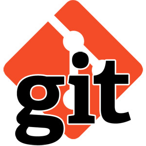

# Git 企业开发者教程

Git 企业开发者教程是由LEANSOFT团队编写并开源提供给社区的企业级Git配置管理教程，教程本身也使用Git进行版本管理并使用我公司内部 Team Foundation Server 作为主要版本Git库，通过TFS流水线自动发布于 DevOps 文档中心 和 GitHub。

本套教程主版本发布于 DevOps 文档中心 https://docs.devopshub.cn/mdwiki/#!docs/g4e/index.md

并在一下地址同步更新

* DevOps 博客 http://devopshub.cn/
* 博客园 http://www.cnblogs.com/ups216/

## 目录

### [前言](index.md)

### 1. 基础篇

* [为什么要使用版本控制系统](basic/01-what-is-scm/index.md)
* [Git 分布式版本控制系统的优势](basic/02-git-intro/index.md)
* Git 安装和设置
* 初始化Git存储库(Repo)
* 起步 1 – 创建分支和保存代码
* 起步 2 – 了解Git历史记录
* 起步 3 – 拉取请求 Pull Request 工作机制

### 2. 进阶篇

* 使用已有Git Repo提交和共享代码
* 创建新的Git Repo
* 理解Git提交(commit)工作机制
* 使用Git分支(branch)进行工作
* 使用Git推送(push)共享代码
* 使用Git获取/拉取(fetch/pull)更新代码
* 使用拉取请求(Pull Request)进行代码检视
* 使用Git变基(rebase)更新代码
* 使用Git提交拣选(cherry pick)功能在分之间复制改动
* 解决合并冲突(merge conflict)
* 撤销改动
* 忽略文件
* 使用Git历史记录比较文件，分支或者获取历史版本

### 3. Git企业开发者篇

* 在VSTS/TFS上创建Git仓库
* 迁移已有代码库到Git仓库，如：SVN，TFVC
* Git服务器的权限管理
* Git分库规则
* 大规模团队的Git配置管理流程
* 使用Git支持敏捷/瀑布式开发流程
* Git与持续交付（配置持续集成和持续部署）

### 4. Git分支策略篇

* Git 分支策略设计的原则，调试单元，部署单元，测试单元
* Git 与团队结构，产品/项目发布特性，产品生命周期
* Git 拉取请求与可靠持续交付
* Git 分叉(Fork)与分支(Branch)的区别
* 传统分支模式与特性分支模式的比较
* 特性分支+拉取请求+质量门模式
* 混用分叉(fork)与特性分支(feature branch)

## Git常见问题

* [解决Git在Windows上使用http/https无法认证的问题](faqs/01-git-on-windows-issues/index.md)
* [如何修改 gitconfig 和常用配置](faqs/02-gitconfig/index.md)
* [如何定位Git执行过程中的问题](faqs/03-debugging-git/index.md)

## 参考

如果希望了解使用Git管理和发布文档的机制，请访问以下链接：

* [Markdown/reST 文档发布流水线](http://devopshub.cn/2017/01/06/markdown-rest-release-pipeline/)
* [GitHub + VSTS 开源代码双向同步](http://devopshub.cn/2016/05/09/vsts-github-open-source-code-flow/)

## 反馈

如果您在使用此文档的过程中遇到任何问题，请扫描以下二维码关注我公司公众号，并通过留言的方式与我们取得联系，我们会在第一时间回复您的问题。

## 版权

本文档内容由LEANSOFT提供并拥有版权，访问者可将本文档提供的内容或服务用于个人学习、研究或欣赏,以及其他非商业性或非盈利性用途,但同时应遵守著作权法及其他相关法律的规定,不得侵犯本文档及相关权利人的合法权利。除此以外,将本文档任何内容或服务用于其他用途时,须征得LEANSOFT的书面许可。

版权所有(c)英捷创软科技(北京)有限公司 LEANSOFT

作者:   **LEANSOFT**

主页:   [DevOps 文档中心](http://docs.devopshub.cn)
