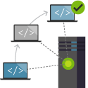

# 基础篇 #1 什么是版本控制系统

Git是一种版本控制系统，让我们首先了解一下使用版本控制系统的必要性。

版本控制系统有助于你跟踪和保存在一段时间内所修改的代码，同时帮助你跟踪所有你所作出的变更，它就如同一部相机，不停的帮助你记录某一时刻的代码状态快照并永久保存这些快照，以便你可以在未来的任何时间找回之前的改动。

如果没有版本控制系统，你需要在自己的计算机上保存同一份代码的多个副本才能确保满足很多常见的开发场景。我相信很多刚刚接触编程的同学都这样做过，但是这样做会非常危险，因为你可能会误删或者修改了其中某些文件，造成工作丢失，最糟糕的是，你无法知道你为什么做了这些改动以及做了什么改动。在团队开发的场景下，版本控制系统变得更加重要，因为你会非常频繁的和其他开发人员交换代码，有时需要同步，有时需要并行，如果没有版本控制系统，这一切会变成每个人的噩梦，让你无法专注于你的开发工作，造成极大的浪费的效率损失。

对于企业开发者而言，如果没有版本控制系统基本上就无法开展日常工作，因为与个人开发不同的是，企业开发需要几十人甚至成百上千人协同完成开发工作。同时，企业级软件还存在多个并行发布版本，多个运行环境（调测，测试，预生产，生产等），多种专业分工（架构，设计，开发，测试，运维）等复杂情况；要适应这样复杂的情况，没有高效的版本控制系统和适当的分支策略和流程控制是不可能实现的。

简单总结一下使用版本控制系统的好处如下：

统一工作方式：版本控制系统工作流可防止每个人使用各种不兼容的工具按照自己的习惯进行开发的混乱局面。 版本控制系统提供流程强制执行措施和权控制能力，让所有人都有章可循。这对于企业开发者尤其重要，虽然软件开发是非常强调单个开发者个性的过程，但团队开发中个性化的环境和工具只能造成协作效率的下降，因此通过统一的版本控制工具来统一所有人的工作方式至关重要。

跟踪改动：每个版本都有一个关于版本更改（如修复 bug 或新增功能）的说明。 此说明有助于按版本（而不是按各个文件更改）来跟踪代码更改。 可以根据需要随时在版本控制系统中查看和还原各个版本中存储的代码。 这样一来，你就可以在任意一版代码的基础上轻松开展新工作。这一特性对于很多企业开发中场景的场景非常有帮助，比如：在同步开发新版本的时候需要临时解决一个线上问题，我们必须能够精准定位线上环境所使用的代码版本，在这个版本上进行修复并快速发布解决问题，同时还要确保这个bug修复不会在未来版本被遗漏。

团队协作：版本控制系统可以帮助不同开发人员同步代码版本，并确保你的更改不会与团队其他成员的更改相互冲突。 团队依赖版本控制系统中的各种功能来预防和解决冲突，让团队成员可以同时进行代码修改。很多人在使用版本控制系统时最头疼就是冲突的解决，因此很多团队会禁止成员使用分支。对分支进行一定程度的控制是很有必要的，但是控制过死会让团队成员束手束脚，造成团队成员之间的紧耦合，从而降低开发效率。有效的分支策略需要综合考虑多种因素，包括：团队结构，发布方式，环境部署流程，职能团队间的配合，代码质量的控制等。Git所代表的分布式版本控制系统有效的平衡了管控和自由之间的矛盾，允许你设计成最适合你的团队的编码协作模式。

保留历史：在团队保存代码的新版本时，版本控制系统会保留变更历史记录。  团队成员可以查看此历史记录，了解是谁在何时进行更改以及更改原因。 有了历史记录，你就有信心进行各种尝试和探索，因为可以随时回退到上一正常版本。历史记录不仅仅可以帮助成员有效的了解代码的来龙去脉，还能帮助成员避免犯错误。基于历史记录进行一定的数据分析后，我们可以让开发人员更智能的进行工作。

配合持续集成：持续集成/发布工具必须和版本控制系统有效的集成才能发挥出真正的能量，一个高效的分支策略的设计必须考虑持续集成和发布的要求，同时兼顾开发流程的有效性。持续集成和持续发布已经成为现代企业级软件开发的必需品，降低软件发布过程的成本，减少错误，避免失误，这些都需要CI/CD的配合。但是我们改在怎样的代码版本上进行CI/CD，这恐怕是困扰很多人的难题。我见到的大多数团队的CI/CD都是与某一分支绑定的，这其实一种错误的做法，因为这样你只能在代码已经进入分支之后才能进行验证，CI对于代码质量的验证成为了马后炮，无法起到预防的作用；使用Git我们可以针对代码变更进行预评审，预合并和预构建和发布，让你更为有效的组织自己的CI/CD流水线。

小结

版本控制系统的优化对于提高软件开发团队效率至关重要，充分了解你所使用的版本控制系统的特性并加以利用是每个开发人员都必须掌握的基本能力。
