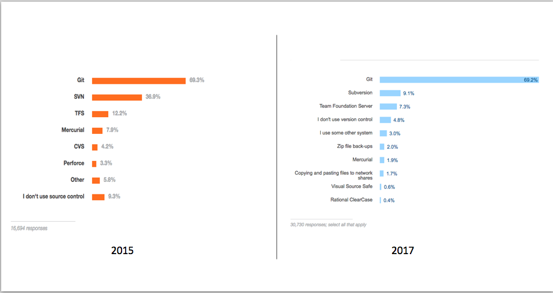
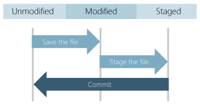

# 基础篇#2 Git分布式版本控制系统的优势

Git是当前最棒的版本控制系统，已经迅速成为了事实的业界标准，以下是Stackoverflow网站在过去几年中针对版本控制系统使用情况的统计，你可以明显看出Git所占的绝对领导位置。

具体数据请参考：

* https://insights.stackoverflow.com/survey/2015
* https://insights.stackoverflow.com/survey/2017

Git和其他版本管理系统最大的区别在于它是一种[分布式的版本管理系统（DVCS）](https://en.wikipedia.org/wiki/Distributed_version_control)，这主要是针对类似SVN, TFVC或者ClearCase这种[集中式版本管理系统（CVCS）](https://en.wikipedia.org/wiki/Concurrent_Versions_System)而言的。简单来说，每个Git存储库都是一份完整的代码，历史记录以及分支的集合，而CVCS系统只在服务器上保存所有这些信息，而在本地一般只有当前版本和至多一个历史版本。这种能力赋予了开发人员非常灵活的工作方式，因为分支/查找历史/比较/合并等操作都不需要通过服务器进行，就可以更为轻松的脱机工作或者远程工作；同时在连接到网络的时候又可以和其他人共享代码。

Git 的灵活性和用户接受度使之成为任何团队的首选。 现在，许多开发者和大学毕业生都已知道如何使用 Git。Git 的用户社区中已有许多资源可用来培训开发者，同时 Git 的用户接受度使得用户可以在需要时轻松获得帮助。 几乎所有的开发工具和技术栈都支持 Git，Git 命令行工具可以在所有主要操作系统上运行。对于企业来说，如果不使用Git会让那些新入职的开发者感到非常不适应，并且大幅度降低他们的开发效率，我曾将见到过开发者因为应聘企业使用老旧的开发工具而拒绝接受企业的Offer。

## Git的一些基本概念

### 提交 (commit)

每当通过git保存修改时，Git 会创建一个提交 (commit)。 提交就是在某一个时间点所有文件改动的快照。 如果在下一个提交中文件没有变化，Git 会使用之前存储的文件。 每一个提交都针对前一个提交保存一个链接，这种链接关系形成了一个开发历史的数据链路。

这种链接关系让我们可以将代码还原为以前的提交、检查两个提交的文件变化，并能查看何时在哪里进行了更改等信息。 每个提交在 Git 中都有一个唯一的标识 (commit id)，这个id是通过对提交的内容执行加密哈希算法得出的。 由于一切都已经过哈希处理，因此 Git 一定可以检测到更改、信息丢失或文件损坏。

### 分支(branch)

Git分支与传统版本管理系统不同，并不会在文件系统中创建重复的文件，而是通过修改当前文件所指向的具体版本(commit id)来实现的，所以你不必切换文件夹就可以所以切换到任何分支上工作。

### 文件和提交状态

Git 中的文件有以下三种状态：已修改(modified)、已暂存(staged)或已提交(committed)。 首次修改文件时，更改只存在于工作目录中。 这些更改还不属于提交或开发历史记录。 必须暂存(stage)要包含在提交中的已更改文件（可以省略其中某些文件）才能将改动提交到Git。 暂存区域包含下一个提交将包含的所有更改。 对暂存文件感到满意后，你就可以提交(commit)这些文件，并为提交添加描述信息。 这个提交就成为开发历史记录的一部分了。

## Git的优势

### 并行开发

每个人都有自己的代码本地副本，可以同时在自己的分支上工作。 你也可以脱机使用 Git，因为几乎所有操作都是在本地执行。

### 加快发布速度

借助分支，可以灵活地进行同步开发。 主分支(master)作为发布版本的稳定代码。 功能分支(feature branch)包含正在进行的工作，完成后将合并到主分支中。 通过将主分支与正在进行的开发分隔开来，可以更好地管理稳定代码，并更为高效安全的发布代码。

### 内置集成

因为 Git 用户接受度非常高，它已被集成到大多数工具和产品中。 所有主流的 IDE 都内置有 Git 支持，还有很多工具提供了与 Git 集成的持续集成、持续部署、自动测试、工作项跟踪、指标和报表功能。 这种集成简化了日常工作流，降低了企业开发中工具二次开发，集成和定制的需求。

### 强大的社区支持

Git 作为开放源代码管理系统，已经成为版本控制系统的业界标准，为团队提供所需的一切工具和资源。 相比其他版本控制系统，Git 的社区支持非常强大，你可以在需要时轻松获得帮助。

### Git适用于团队协作

将 Git 与其他工具配合使用，可以鼓励团队协作、同时确保策略的实行、实现自动化，并能提高工作的可见性和可跟踪性，从而提高团队的工作效率。 你可以单独选择不同的版本控制系统、工作项跟踪系统以及持续集成和部署工具。 也可以选择 Visual Studio Team Services 作为端到端的管理工具，团队具备非常高的自主性和灵活性。

### Git结合拉取请求(Pull Request)

使用拉取请求可以确保代码检视过程的有效，然后再将它们合并到主分支中。 在拉取请求中进行的讨论非常有价值，可确保代码质量并促进团队成员相互学习和协作。 [Visual Studio Team Services/Team Foundation Server](https://almvm.devopshub.cn) 提供了非常棒的拉取请求体验，你可以浏览文件更改、发表意见、检查提交、查看生成，并能通过社交化投票来批准代码合并。

### 分支策略

分支策略是V[Visual Studio Team Services/Team Foundation Server](https://almvm.devopshub.cn) 中提供一项有效保持主分支(master)代码质量的策略机制，让团队可以通过配置灵活的策略实现对主分支的保护，比如：不允许直接向主分支提交代码，必须经过代码检视才能合并，必须经过特定人员批准才能合并，必须解决所有代码检视意见才能合并等一系列非常有效的保护手段；同时也允许你自己定制更加复杂的策略规则来适配团队的不同诉求。

## 小结

到这里，我们对Git的基本工作原理和它的优势具备了一些了解。下一章中我们将开始搭建Git操作环境。
