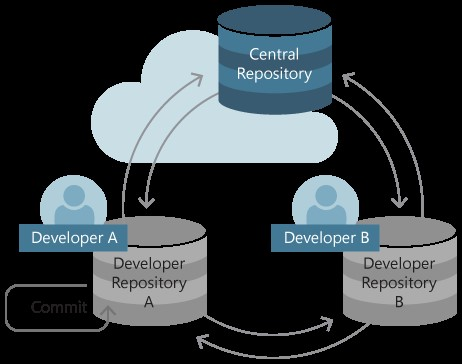
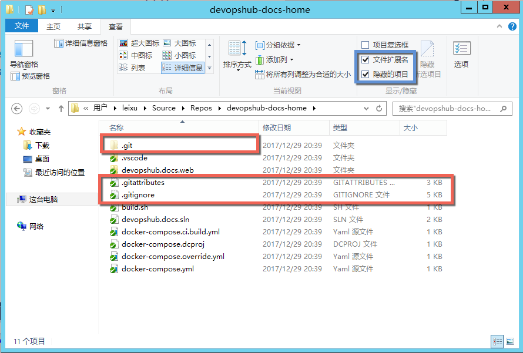
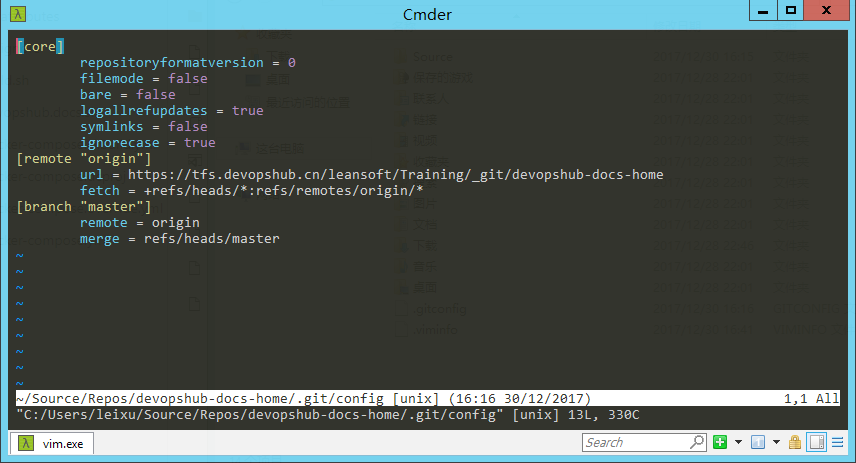
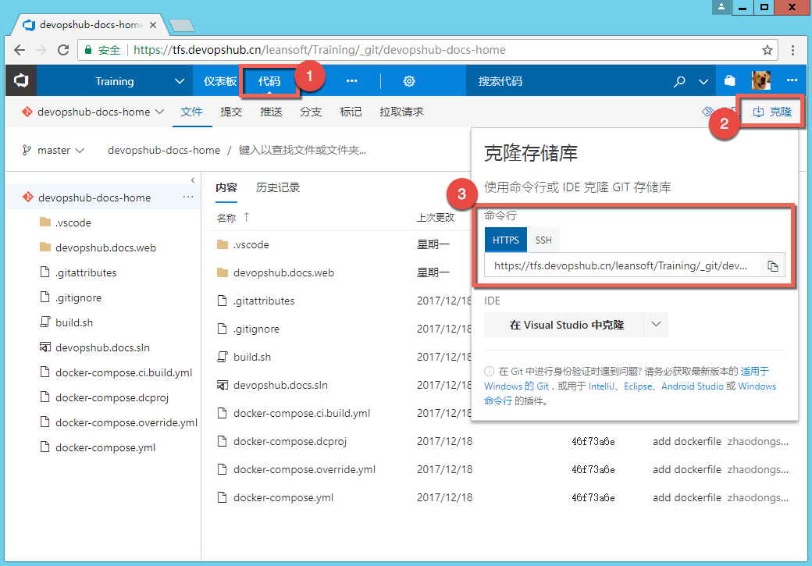
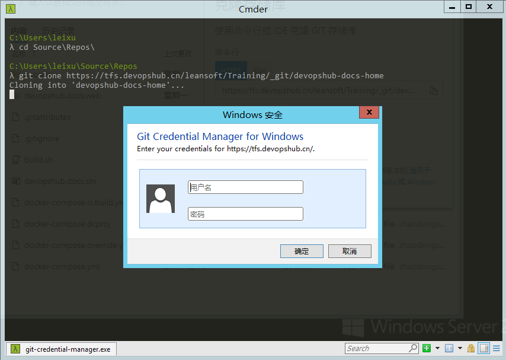
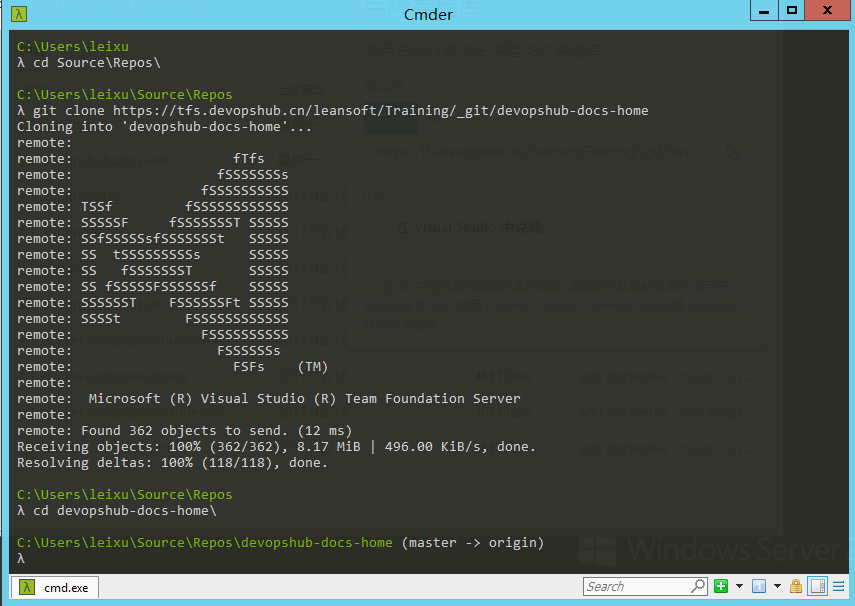

# 基础篇 #4 了解Git存储库(Repo) 

Git
存储库看上去就是一个文件夹，只是在这个文件夹中不仅仅保存了所有文件的当前版本，也同时保存了所有的历史记录，这些额外的信息都保存在当前文件夹下面的.git子目录中。因为前面我们所描述的git跟踪改动的特殊方式
，git可以在很小的开销下保留非常复杂的历史记录，同时也由于这种跟踪方式，使得git可以通过改变链接指向的方式随时切换当前目录中任何文件的版本，从而实现了在同一套文件系统上切换分支的功能。 

 

虽然git是分布式版本控制系统（DVCS），但是在企业开发中，我们仍然需要一个中心git存储库以便不同的团队成员可以更为方便的交换代码。与集中式（CVCS）的中心存储库不同，Git的中心存储库与任何开发人员的本地存储库都保留了一致的代码变更，因此开发人员不必连接到中心存储库就可以完成获取历史记录，拉取分支，合并分支等操作；这给予了每一名开发人员离线工作的能力，同时允许每个人在本地创建自己的分支结构进行尝试，在开发人员认为本地的分支需要共享给其他人的时候，他们可以将本地分支推送至中心存储库，这样其他开发人员也可以获取这些共享的更改。所以，在企业中使用Git并配合中心存储库可以兼顾团队开发中共享和独立开发的诉求，让开发人员具备很高的自由度的同时又不会丧失代码集中存储所带来的优势。 

 

当然，开发人员也可以不通过中心存储库共享代码，但是这种做法在企业中是不推荐的，虽然在GitHub上这基本上是普遍的工作方式，但是这种工作方式并不适合与企业开发。与开源软件不同的是，大多数企业开发都是多人协作完成同一个项目，而开源代码的开发则更需要每个人具备独立的版本根据自己的需要进行定制。 

 

 

##Git存储库的基本结构 

 

 

*注：在任何的操作系统中，使用.开头的目录都会被默认隐藏掉，所以要看这些文件需要打开隐藏文件显示和扩展名显示才能看到上面的视图。 *

 

.git目录 

git的数据目录，里面保存了git自己管理的数据文件，用于实现git的各种功能；删除这个文件等同于删除所有git历史记录，而你的目录就变成了一个普通的文件目录。 

 

.gitattributes文件 

 

用来对当前目录中的git的一些行为进行配置的文件，它能够做到很多事情，比如：指定哪些文件是二进制的以便git不会对它们进行文本比较，指定使用metadata的方式对图片文件进行比较，指定分支间特定文件的合并策略（比如保持master为固定版本，忽略任何合并进来的版本），或者在暂存文件的时候调用某些脚本执行一些动作，等等。 

 

详细说明：https://git-scm.com/book/en/v2/Customizing-Git-Git-Attributes 

 

.gitignore 文件 

 

这是一个非常重要的配置文件，用来指定哪些文件应该被忽略掉。因为我们在开发中经常会创建很多临时文件，比如：编译过程的中间文件和最终产生的二进制，这些都不应该被提交到git仓库中。因此我们需要根据不同的技术栈来配置这个文件以便可以正确的忽略那些不应该提交的文件类型。 

 

好在github上已经收集了基本所有你会用到的gitignore文件，只要根据你所使用的技术栈选择并放入存储库即可：https://github.com/github/gitignore 

 

 

##Git的三级配置系统 

 

以上我们在某个git仓库中看到的.gitignore和.gitattributes都属于Git的三级配置系统的一部分，用于对当前仓库进行配置，另外两个级别分别是
global 和 system。 他们的结构如下 

 

-   system  

    -   global 

        -   repo 1 

        -   repo 2 

        -   … 

 

**系统级** 

 

system 为系统级配置文件，在Windows上存放于Git的安装目录下（默认位置为C:\\Program
Files\\Git\\mingw64\\etc\\gitconfig）。如果要直接对这个配置进行编辑可以使用以下命令 

 

git config --edit --system  

 

 

*注：编辑系统级配置的命令行窗口需要提升权限运行，否则无法保存。 *

 

**用户级别** 

 

global 为当前用户的全局配置文件，在Windows上存放于当前用户的根目录（默认为
C:\\Users\\{你的用户名\\.gitconfig）。如果要直接对这个配置进行编辑可以使用以下命令 

 

git config --edit --global 

*注：你会注意到我们在Git安装配置那一章中所做的配置实际上就是在修改这个文件。 *

 

**存储库级别** 

 

Repo
级别就是当前存储库的配置文件，存放在当前存储库的根目录，编辑时需要先进入当前存储库的目录，再执行以下命令 

 

git config --edit  

 

 

以上我们提到的.gitattribute .gitconfig
.gitignore都可以通过这三个级别分别配置，越接近git repo的配置生效级别越高。 

 

有关gitconfig的更多配置内容请参考：FAQ \#2  

 

##获取Git配置的库的两种方式 

 

**新建存储库** 

 

只需要新建一个目录，然后在里面执行 git init 命令即可完成 git
库的创建。具体命令操作如下 

 

\>\>\> mkdir my-new-repo 

\>\>\> git init 

 

 

**克隆存储库** 

 

首先从远程存储库获取clone地址，然后使用git
clone命令即可完成克隆操作。如果远程存储库是开放的，那么克隆会立即开始；如果远程存储库是私有的，则要看你之前是否已经将账号信息通过Git
Credential Manager存储，如果没有则会弹出登陆对话框。类似以下流程： 

 

1.  获取Git存储库地址 

 

如果你已经按照之前的安装配置要求创建了VSTS账号，你则可以通过 **代码 \| 克隆**
找到存储库的url地址 

 

 

复制这个地址，我们就可以进行后续的 clone 操作了。 

 

1.  运行 git clone  命令，输入账号并完成克隆操作 

 

\>\>\> git clone {远程存储库url} 

 

第一次操作一个陌生的远程存储库会需要你输入用户名和密码 

输入正确的用户名和密码后，克隆会开始，完成以后你就可以开始操作本地git存储库了。 

 

 

##小结 

 

至此，我们已经可以获取一个Git存储库了，后面的篇章我们将开始对它进行最基本的代码修改，分支，合并，推送和历史记录查看等基本操作。 

 

 
