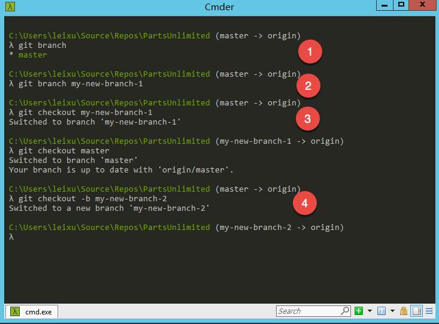

# 基础篇 #5 创建分支和保存代码 

使用版本控制系统最常见的工作流程就是修改代码，保存代码，共享代码。Git提供了一个简单的3步工作流，让你方便的完成这些操作。 

 

1.  新建工作分支 

2.  提交更改 

3.  推送分支到中心存储库与团队成员共享 

 

 

##Git 工作流 

 

按照以上3步操作，我们就可以开始日常的编码工作流了。下图中展示了这个工作流的示意： 

 

 

下面，我们按照这3个步骤来完成一个典型的Git提交的创建过程： 

 

1.  创建分支 

 

创建分支之前你需要获取Git存储库，这部分请参考之前的内容。将命令行切换到存储库中的任意目录，然后执行以下命令： 

 

\>\>\> git branch 

 

不带分支名称命令可以查看本地已经存在的分支 

 

\>\>\> git branch \<分支名称\> 

\>\>\> git checkout \<分支名称\> 

 

带有分支名称的branch和checkout命令用于创建和切换分支，你也可以通过一个命令完成以上操作 

 

\>\>\> git checkout -b \<分支名称\> 

 

执行完成后你会看到命令行的提示符发生变化，表示你已经切换到一个分支上进行工作了。 

 

 

1.  提交代码到分支 

 

首先通过cmder中的命令提示行确认你所处的分支是正确的，注意下图中的
(my-new-branch-2 -\> origin)
这表示我们当前处于my-new-branch-2这条分支上，后面的origin是git远程存储库的一个标识，表示当前我们跟踪的是origin这个别名的远程存储库。 

 

 

*注：关于远程存储库我们在后面进阶篇会专门进行介绍，这里你只要知道这就是你克隆代码的那个存储库就够了。 *

 

在以上命令行状态下键入以下命令打开 Visual Studio Code，编辑文件并保存退出。 

 

\>\>\> code .  

 

 

以上我们对2个文件进行了变更，a.txt是一个已经存在的文件，b.txt是我们刚刚新建的文件。以上我们保存文件并关闭vscode以后，可以通过以下命令查看当前工作目录中的变更 

 

\>\>\> git status  

 

 

以上输出的内容中有2部分内容需要理解清楚 

 

-   Changes not staged for
    commit：这部分列出的文件表示已经属于存储库的一部分，但是当前的改动并没有被暂存。 

-   Untracked files: 这部分列出的文件还不熟存储库的一部分。 

 

你会注意到在a.txt前面显示了modified，因为a.txt已经是存储库的一部分所以git可以跟踪到你对它的修改，但是对与b.txt
git根本不知道你做了什么，它只知道这里有个文件还没有被git跟踪。 

 

现在，我们需要将这两个文件“暂存”,做好提交准备，执行以下命令完成暂存 

 

\>\>\> git add --all  

\>\>\> git status 

 

 

你也可以使用文件名或者通配符替换--all参数，只添加那些自己认为需要暂存的文件。如果暂存错误，以下命令取消暂存。 

 

\>\>\> git reset HEAD \<file\> 

 

这时git已经将2个文件全部放入了暂存区，准备进行提交。这时你可以执行以下命令完成提交，git会对当前文件创建快照，形成版本记录。请执行 

 

\>\>\> git commit -m "my first git commit" 

 

 

git commit
命令用于提交代码变更到git存储库，后面的-m参数由于给出你的提交注释，在git中提交注释是必选项，不能掠过。这其实是一个非常好的设计，我想你一定为了在svn代码库中看到一堆没有注释的变更骂过街。 

 

完成 git commit
命令后，你的git中就已经保存了刚才所做的代码改动了。现在你可以继续编码，并在感觉必要的时候随时重复以上的过程保存自己的改动，就不用再担心会丢失代码了。 

 

你还可以随时切换回到master分支，这个操作不会要求你更改目录，而在编辑器里面的代码会直接切换到master分支的代码状态。只要执行 

 

\>\>\> git checkout master 

 

 

注意当我完成切换的是时候，我们之前创建的b.txt从vscode中消失了，同时a.txt里面之前修改的内容也不见了。如果要找回改动，只要再切换回到刚才的分支即可。 

 

1.  推送分支到中心存储库与团队成员共享 

 

企业开发中推常见的场景就是团队协同，开发人员本地完成修改后需要共享给其他开发人员一起使用，这时我们可以利用中心存储库来完成这个操作。首先确保你处于自己希望共享的分支中，然后运行： 

 

\>\>\> git push origin my-new-branch-2 

 

 

完成操作后，你的本地分支就被推送到中心存储库上了，这时其他开发人员就可以通过以下命令获取你的分支代码。 

 

\>\>\> git fetch 

\>\>\> git checkout my-new-branch-2 

 

*注意：git允许你在本地和远程使用不同的分支名称，这给予开发人员更多的自由度，但是有时候也会造成麻烦，比如可能你忘记了你本地分支已经在跟踪一条远程分支，不小心改错了代码。 *

 

为了能够更加清晰的标识分支的所有人，一般我们在建立分支的时候会通过前缀的方式来标识，使用特定格式的前缀可以让VSTS/TFS将你的前缀变成分支文件夹形式显示，便于管理。如下图，在创建分支的时候使用了
leixu/ 作为前缀，推送到服务器上以后就变成文件夹显示 

 

 

你甚至可以设置多级文件夹，这样在团队比较大的时候管理起来就容易多了。 

 

 

##为何一定要使用分支？ 

 

为什么改动一定要放在分支中实现。这个与软件开发本身的特性有关系，软件开发过程本身是一个不确定的过程，没有人可以在代码写完之前预测出到底应该怎样写。这个与产品生产制造不同，产品生产制造之前，所有的工序，操作和零件都是确定的，因此我们可以清晰的规划如何完成制造过程，也可以将这个过程组织成流水线顺序执行（注意：这里的流水线特指制造业工厂中的生产流水线，与我们后面说的软件交付流水线不同）。软件的开发过程则完全是一个探索过程，开发人员需要经过多次失败的尝试才能最终找到正确的实现方式，这个过程需要多次修改代码，有时还可能会推翻从来。这种循环往复的过程越接近开发人员的日常编码，越接近最小的功能实现就越发频繁。因此，开发人员必须能够在不影响主干代码的情况下，自助的创建代码副本，在这个副本上完成以上尝试；同时，也需要兼顾代码主干上的变更，确保自己的改动的基准永远与整个团队对齐，否则就算写好了也无法与整个团队的工作集成。这个矛盾是所有配置管理策略要处理的核心矛盾，所有我们所遇到问题，各种复杂的分支策略以及后续的持续交付流水线的设计都是基于这个问题延展出来的，只不过在更加复杂的团队/产品/项目中，这个矛盾被乘各种复杂度被放大，因而需要我们提供更为复杂的配置管理流程来进行适应。 

 

从这一点上稍微扩展一下，你就可以理解其实所有的配置管理流程的设计原则应该是“适应”而不是“控制”，找出最适合团队的流程，让流程为人服务是所有配置管理流程目标。也因为此，我们需要将配置管理流程视为一个变化的规则，它必须根据团队的情况适时改变，才能确保可用。 

 

理解了以上2点内容，我们就知道为什么Git的工作一定要放入分支，而不是在主干上直接操作。如果代码变更直接进入master或者团队成员共享的分支，则会直接对生产环境或者团队成员共享的环境造成影响，在变更还未成熟稳定之前，最保险的做法就是尽量隔离的进行修改直到代码可以被其他成员或者某一环境接受的时候再合并进去。 

 

虽然任何的配置管理工具都允许你创建分支，但是Git的以下2个特性决定了它超越其他任何配置管理工具成为团队的首选： 

 

1.  轻量级分支：Git的分支非常轻，可以在瞬间完成创建，也可以随时被销毁；拉分支不会增加Git存储库的存储开销，只有当你提交修改的时候才会增量的增加相应的存储内容。 

2.  同文件夹内切换分支：Git分支切换不需要切换文件夹，这样可以和开发工具更好的集成，开发人员可以快速的在不同分支间进行切换，甚至都不需要停止IDE里面的Debug进程。这让开发人员更加敏捷的进行尝试，更加快速的解决问题。 

3.  本地分支：因为分布式的特点，Git分支不需要依赖服务器就可以完成。给予开发人员独立的，不依赖其他人就可以进行尝试的可能性。而在集中式配置管理工具中，任何分支的创建都必须是由配置管理员才能完成的工作，这大大降低了单个开发人员的效率。 

 

采用集中式版本控制(CVCS)的系统并不是不能创建分支，但是由于分支过于沉重，开销太大，团队往往会选择只允许配置管理员才能执行这个操作，这就让开发人很受束缚。 

 

*注：当然，也正是因为以上这些优势，才让很多企业的大规模团队管理者对Git敬而远之，觉得它太过灵活。其实Git完全兼顾了大规模团队的管控要求，只是实现的方式与传统的配置管理工具不同而已，这一点我们会在第3部分中专门讨论。 *

 

##小结 

 

在这一篇中我们介绍了基本的Git编码工作流程，了解了这些你就可以开始使用Git进行日常的编码工作了。当然，既然Git推荐我们尽量使用分支来维护变更，那么就必须允许我们进行合并，这样才能最终完成团队开发的协作。这部分会在下一篇中进行介绍。 
