# 基础篇 #6 了解Git历史记录 

Git的版本历史记录采用了与传统集中式版本管理系统完全不同的方式进行组织，在刚开始使用Git的时候我们往往会不知所措，比如看到这样的历史记录。 

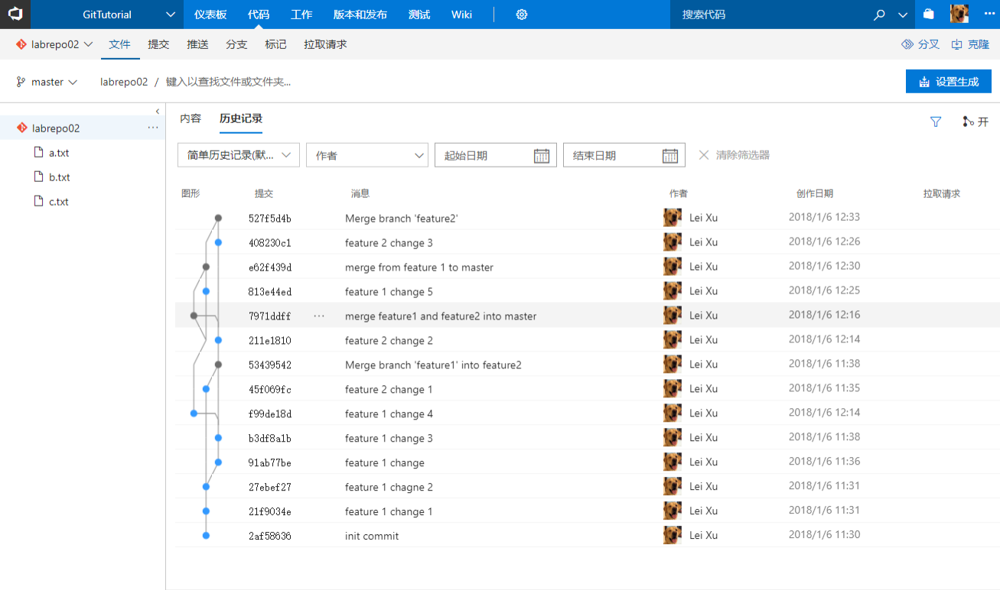

看到这个七拐八拐的图形，你可能完全不知道它代表了什么。其实这正是Git的特别之处，Git之所以能够实现之前我们所说那些灵活快速的操作，都是因为它采用这种类似链路的版本记录方式。在这一篇中，我们就一起了解一下这个图形是如何生成的。 

 

这里，我们要模拟一个常见的开发场景： 

 

-   你正在开发一个网站的某个新功能，按照Git的推荐方式，你创建了feature1分支来承载这个新功能的代码变更。 

-   当你已经在这个功能上完成几次代码提交的时候，你的项目经理告诉你这个网站现在出现了一个严重的线上问题，需要紧急修复。 

-   为了能够快速修复这个线上问题，你不能等待下一个版本发布，必须在现有线上版本上进行修复。这时你暂停了feature1分支的开发工作，切换回到master分支，从新拉取一个名为hotfix的分支并在这个分支上开始了线上问题的修复。 

-   当你完成了修复并测试通过后，你将hotfix分支合并到master以便立即从新发布线上版本。 

-   完成以上工作后，你切换回到feature1分支继续进行新功能的开发直到新的功能也经过测试可以发布。 

-   最后你将feature1分支也合并回到master分支，发布到线上环境。 

 

为了演示这个过程，首先我使用 Visual Studio
创建了一个新的Web网站项目，完成了4次提交并推送到了TFS的Git仓库。 

 

##初始状态 

 

初始的历史记录显示如下： 

 
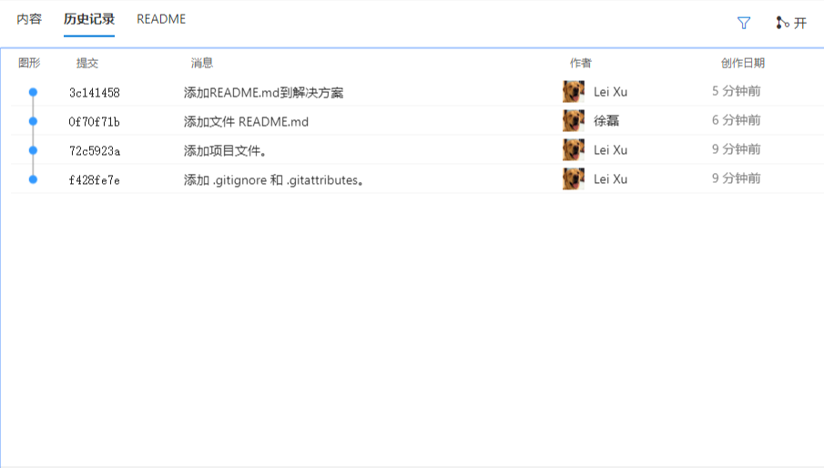
 

用简单的示意图表示，是这样的： 

 
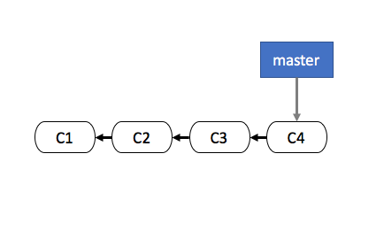
 

如果使用命令行查看历史记录可以键入如下命令 

 

\>\>\> git log --oneline --graph 

 

以上的--oneline参数让git只输出第一行的注释信息，简化历史记录更加可读；--graph参数用来在命令行中输出图形链路，现在我们还看不到效果，后面就会有变化。 

 

输出的结果如下 

 
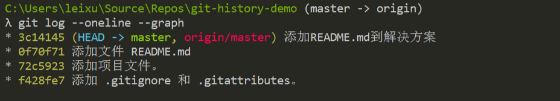
 

*注：如果你在使用以上命令的过程中遇到乱码，请参考：常见问题\#4 *

 

这表示当前的master分支指向版本库最新的一次提交（C4），同时之前的所有提交都是顺序完成的，形成了一个单一主线的链路。在TFS的版本记录视图上你所看到的图形一列表示的是同一个意思。 

 

##创建feature1分支并提交2次变更 

 

现在，按照我们在上一篇中介绍的方法，创建feature1分支，并在这上面完成2次新的提交。 

 

此时再次使用上面的命令列出历史记录，你会看到如下结果： 

 
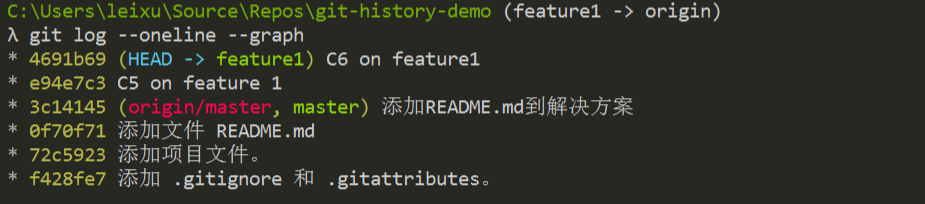
 

这个时候你就会有点纳闷了，为什么明明做了分支，历史记录仍然是单一的直线呢？不是应该分叉了吗？看一下示意图你就明白了。 

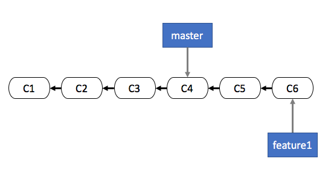

Git确实记录了你的分支信息，只不过它非常聪明的只是修改了feature1所指向的提交而已；这时你的master分支仍然指向C4提交，而feature1分支则指向C6提交了。 

 

以上git
log所输出的信息中也非常明确的标明了这一点，看一下历史记录的第1行和第3行括号里面内容就明白了。 

 

##创建hotfix分支并提交另外2次变更 

 

现在那个讨厌的项目经理给你下达了新的任务，要修复线上问题。因为线上所部署的正是master分支上的最新版本，所以你需要切换到master分支（也就是C4提交所代表的版本）进行修改。 

 

这时你可以使用以下命令完成hotfix分支的创建 

 

\>\>\> git checkout master 

\>\>\> git checkout -b hotfix 

 

完成这个操作后，我们在hotfix分支上输出历史记录。 

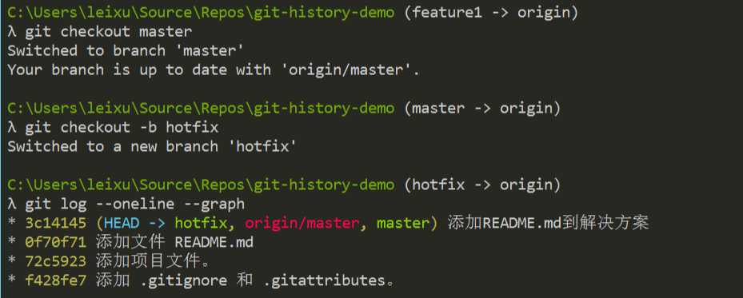
 

你会看到现在hotfix和master分支同时指向了一个提交记录（C4），示意图如下： 

 
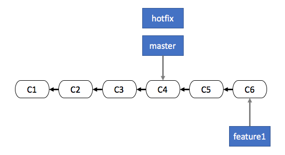
 

现在我们在hotfix分支上添加2个新的变更，并输出历史记录 

 
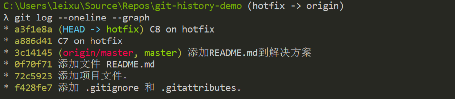
 

现在hotfix所指向的提交变成了 C8，如果再看我们的示意图就可以看到分叉的效果了 

 
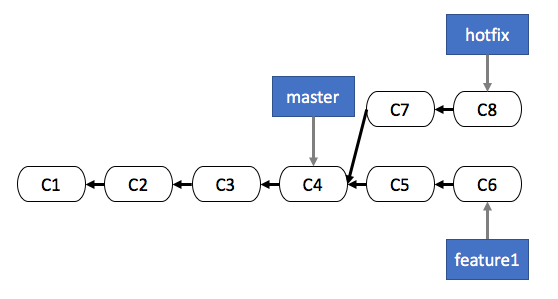
 

但是为什么git 输出的历史记录中仍然是一条直线呢？这是因为对于master,
hotfix和feature1任何一个分支而言，他们的改动对于自己都是单向的唯一链路。 

 

合并hotfix分支到master 

 

现在你已经完成了问题修复，可以将代码合并到master并发布到线上环境了，让我们将hotfix分支的代码合并到master主干上。你需要执行下面命令 

 

\>\>\> git checkout master 

\>\>\> git merge hotfix  

 

这2条命令的意思是回到master分支并将hotfix分支的改动合并进来，因为hotfix就是基于master分支进行的，所以合并会直接完成不会有任何的冲突出现。 

 
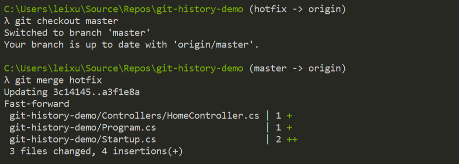
 

这里出现了一个词Fast-forward，因为hotfix分支是直接在master分支上完成的，所以git其实仅仅修改了master分支的指向到hotfix的当前指向（也就是C8），输出一下log你就看得很清楚了。 

 
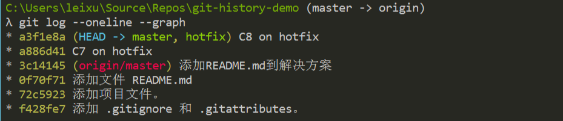
 

对比刚才在hotfix上的log输出，你会看到这里唯一的变化就是本地master分支的指向移动到了最后一条提交上。你也许会注意到这里还有一个origin/master的指向仍然在之前的提交之上，这时因为我们的Git库已经提交到了TFS的中心存储库，而这个origin/master所代表的是这个中心存储库上的master分支所处的位置，因为我们在以上过程中没有给中心存储库推送过代码，所以这个中心存储库的master分支仍然指向的是最初的位置。 

 

**到这里你会明白，Git的分支其实就是一个指针而已，通过这个指针对提交的指向，Git可以非常灵活的切换版本。** 

 

到了这里，我们的示意图就变成了这个样子了 

 
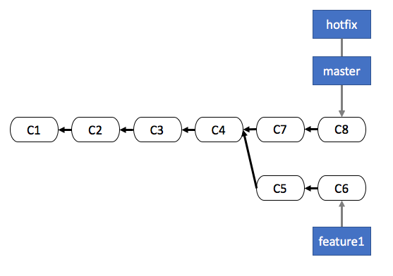
 

##合并feature1分支到master分支 

 

现在你已经修复了线上问题，可以回到feature1上继续工作了。假设我们提交C9以后feature1的开发工作也已经完成可以合并了。与刚才合并hotfix的方法一样，我们只需要返回master分支并执行合并命令 

 

\>\>\> git checkout master 

\>\>\> git merge feature1 

 

执行的效果如下： 

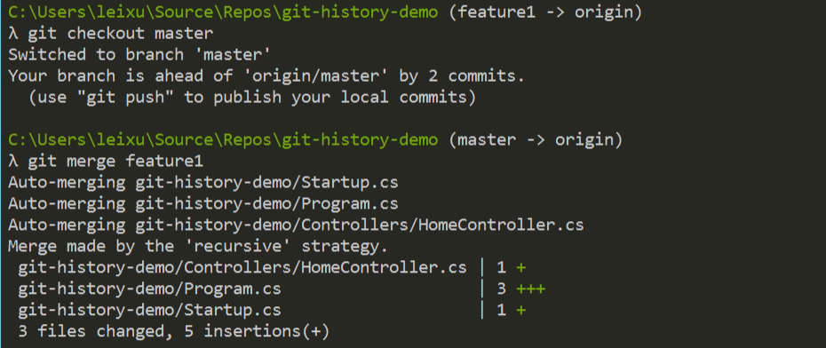

现在如果我们再次在master上输出历史记录，你将看到如下效果 

 
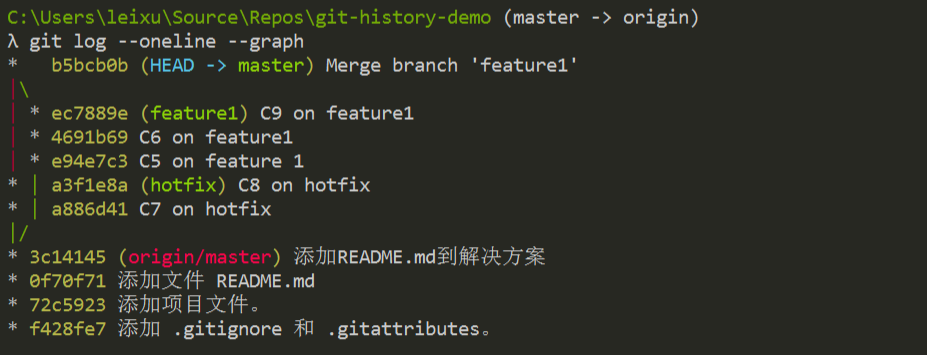
 

你会注意到git创建了一个新的提交 b5bcb0b 并将这个提交的注释设置为 Merge branch
'feature1'，它的意思是我为你创建了一个新的提交，在这个提交里面保存了feature1合并进来的代码变更。 

 

*注意：在执行merge动作的时候出现了3个Auto-merging的信息，这表明Git自动为你完成了3个文件的合并，在实际使用中这样做可能是会出现问题的，因为Git实际上只是根据文件代码行的信息判断是否可以完成自动合并，这种合并并不是永远安全可靠的。这一点我们在进阶篇中会特别介绍。 *

 

现在，我们的示意图就变成了这个样子 

 
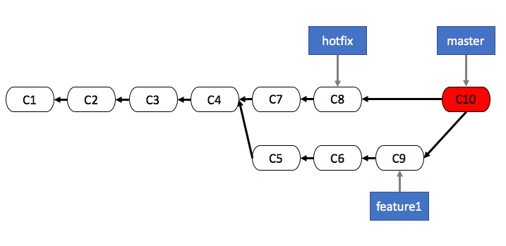
 

最后，我们可以同步代码到TFS中心存储库，并查看服务器上的历史记录。你会看到与我们的示意图非常类似的图形显示。 

 
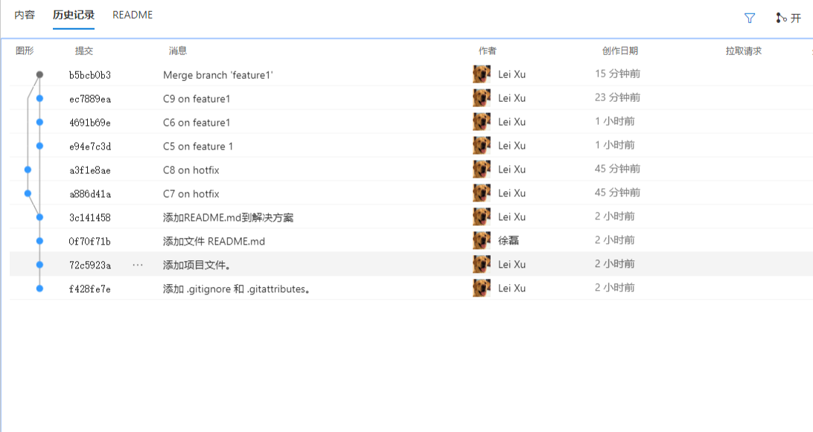
 

##小结 

 

了解Git处理历史记录的方式对于我们用好Git非常重要，特别是在企业级开发中处理复杂的多版本并行开发的过程中。以上我们提到的几个可能令你困惑的地方，比如hotfix分支合并的时候Git仅仅移动指针的行为，以及最后合并feature1分支时Git创建用于合并的提交的方式都是我们在日常开发中常见的情况。理解了Git的特殊处理方式有助于你在遇到类似情况的时候作出正确的判断，并对后面介绍的很多复杂场景更容易理解。 

 

**示例代码：** 

 

以上示例代码已经推送到 <https://github.com/lean-soft/git-history-demo>  

 

 

**参考：** 

 

<https://git-scm.com/book/zh/v1/Git-%E5%88%86%E6%94%AF-%E5%88%86%E6%94%AF%E7%9A%84%E6%96%B0%E5%BB%BA%E4%B8%8E%E5%90%88%E5%B9%B6> 
