# 基础篇 #7 了解拉取请求 Pull Reqeust

拉取请求是Git中特有的工作方式，可以帮助团队更好的控制代码质量，集成自动化构建和部署，创建更好的协作氛围。要理解拉取请求是如何做到这些的，我们首先需要了解什么是拉取请求。

## 什么是拉取请求

拉取请求，从字面意思理解就是“希望对方进行拉取的请求”；但这也是大家最迷惑的一点，拉取请求最早出现于github，是为了让多个不同的git repo之间可以交换代码而提供的功能。基本的操作方式为：

- 开发人员希望为repo A代码进行共享，那么可以fork一份repo A的代码，并在自己fork出来的副本中进行修改；
- 当开发人员觉得代码已经成熟并希望推送给repo A的所有者的时候，他会提出一个请求，并将这个请求发送给repo A的所有者，由repo A的所有者对所提交的修改进行审核;
- 如果repo A的所有者角色接受这些代码修改，则会批准这个拉取请求，将代码合并至自己的repo中。

通过以上过程可以看出，拉取请求是为了最终的合并操作所进行的准备/审核代码的过程而设计的。这里的“请求”是针对代码的接收方而言的，所以我们会有“发送拉取请求”的说法，接收方最终会将代码“拉进”自己的repo，所以名字才会被叫做拉取请求（Pull Request）。

在企业开发中，我们一般采用分支的方式来替代github上面的fork方式，分支更加适合团队成员之间的紧密的协作开发，因此企业中的拉取请求一般是创建在分支之间的。

注：其实不同的fork之间的拉取请求也同样是在分支之间的，因为git独特的分布式特性，不同fork库之间的commit id仍然是一致并且可以被跟踪的，所以我们可以在不同的repo的分支之间进行合并。这种场景在企业中也有应用，我们会在后续的章节中进行介绍。

## 拉取请求的典型流程

下面我们就通过一个典型的拉取请求操作流程来了解它的一些特性。

拉取请求的操作一般通过4个步骤完成：

### 1. 创建分支

这个动作一般是在master分支上，针对某个已经发布到生产环境的版本进行的。在上图中，我们针对c4的这个提交创建了一条feature分支出来，在这个feature分支中开始进行功能开发，Bug修复等改动。

你可以通过下图的方式来创建分支

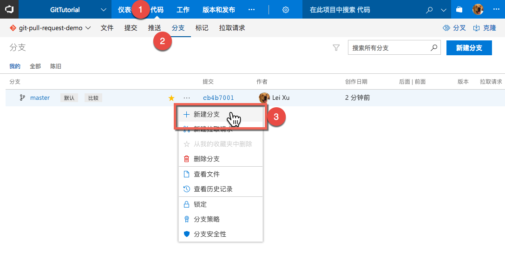

### 2. 创建拉取请求

当在feature分支上完成了至少一次提交的时候就可以创建拉取请求了。创建拉取请求必须要指定“希望拉取这个改动”的目标分支。也就是说，上图中的拉取请求的目的是让master将分支上的代码拉进去，这也是拉取请求这个名字的来源。这里需要注意的是，当分支上还不存在变更的时候，是无法创建拉取请求的，因为没有东西可以让master进行拉取。

另外，拉取请求这个名字还包含了一层含义是，当前我们只是提出了一个请求，希望master接受我们的改动，但是master是否接受，是由master分支所有者来决定的。这一点非常重要，因为它建立了一种“请求->接受”的协作机制。这种机制分离了修改代码和接受代码修改这2件事情，让我们可以在这2个动作之间进行代码评审，静态代码检查，测试等质量验证动作，同时它明确了修改代码的权限和接受代码变更的权限的界限，让代码合并操作更加可控。

拉取请求上所显示的代码变更，其实一直是以master上的最新版本作为基准的，它可以持续的跟踪在feature分支上的代码与master代码之间的差异，无论是master还是feature发生变化，拉取请求都可以检测到。

创建拉取请求有2种方式：

**方式一：TFS/VSTS会在分支上代码发生变化后提示用户来创建拉取请求**

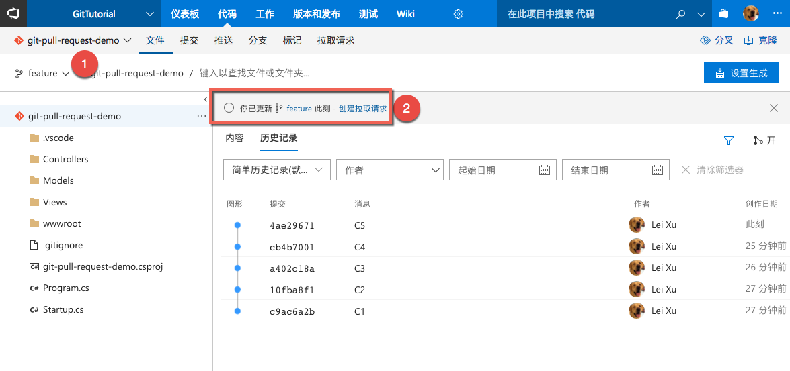

**方式二：通过拉取请求页面直接创建**

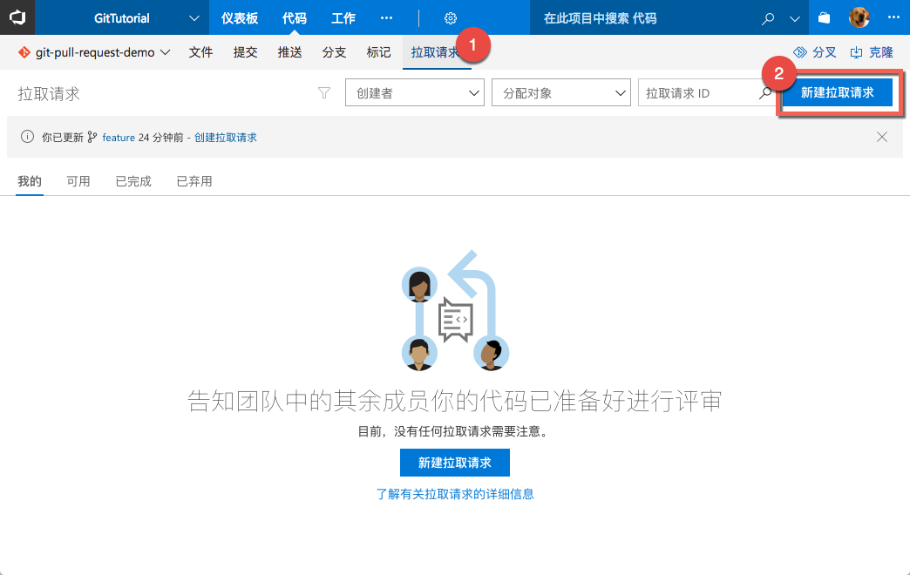

创建拉取请求包含以下关键信息：

1. **源分支和目标分支**：源分支是包含了代码变更的分支，目标分支是将会接受这些变更的分支，也就是将会“把这些改动拉取进去的分支”
2. **标题和说明**：这里应该尽量详细的描述feature分支上将会完成的修改，之所以说“将会”，是因为拉取请求一般在分支上存在变更后的这个时间点就立即创建了，而在完成拉取请求进行合并之前，我们会持续的在分支上提交变更。
3. **审阅者**：指定那些需要给出意见的代码检视人，添加到这里的检视人会收到TFS/VSTS自动发送的通知邮件。
4. **工作项**：将当前拉取请求上的代码变更所涉及到的需求/任务（工作项）关联到这里，帮助团队跟踪这些变更的目的。
5. **文件和提交**：这里TFS/VSTS会列出已经修改过的文件和提交。

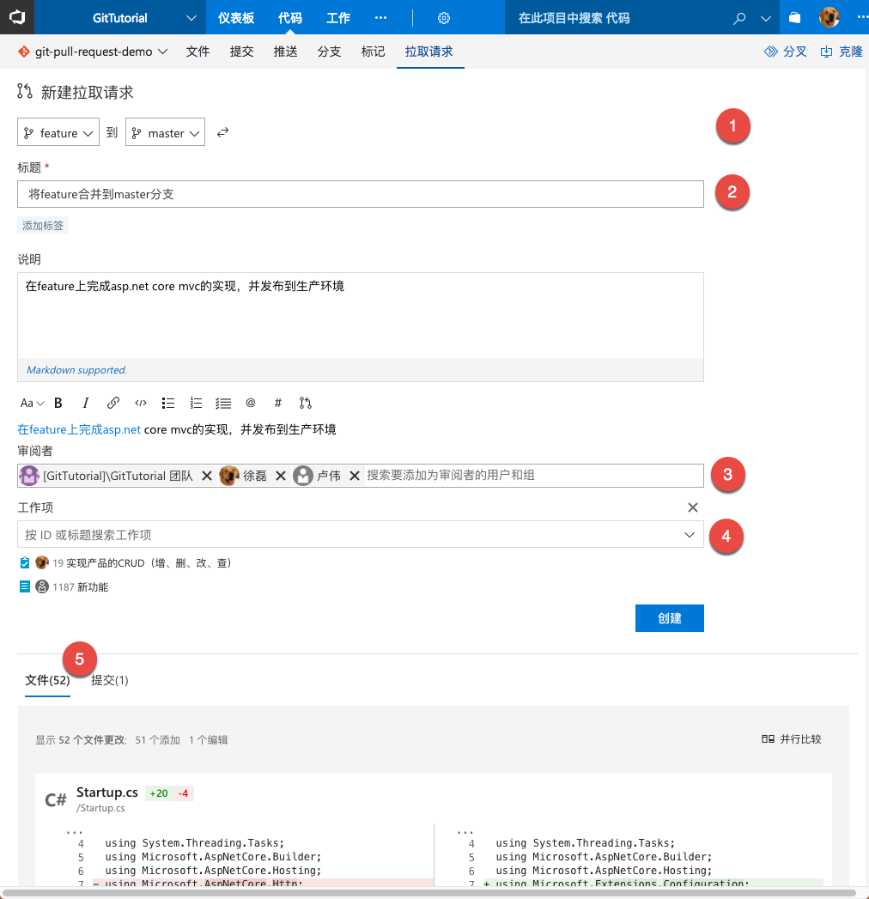

拉取请求一旦创建，团队成员就可以通过概述视图进行讨论，跟踪代码变更。

> 注：在注释中可以使用Markdown格式编写富文本的内容，包括表格，图片等都可以使用，也可以添加附件。

团队也可以针对某行代码进行注释，并将这些注释意见直接作为任务进行跟踪。

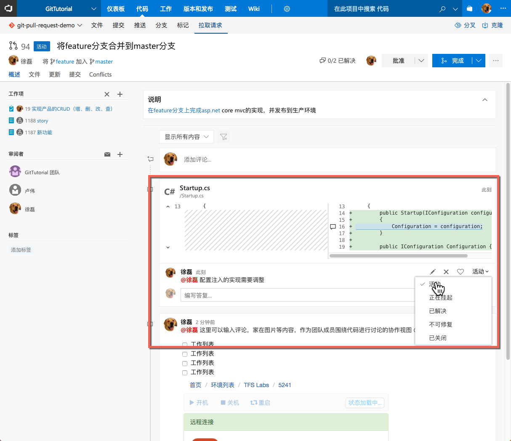

### 3. 更新拉取请求

拉取请求一旦创建，就会持续跟踪所包含的2条分支上的改动，开发人员可以持续的在分支上提交代码，拉取请求会动态的更新并给出提示。

如下图，当开发人员推送了新的更改后，拉取请求页面立即提示用户。

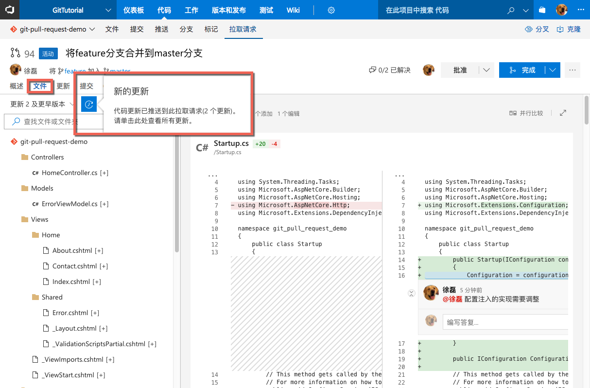

用户可以切换到任何一次变更上查看修改，也可以将所有变更叠加起来一同查看；这一点对于代码检视非常重要。

> 注：在代码检视过程中，我们其实更加关心代码的最终状态，不太关心中间的变更。因此拉取请求默认会显示每个文件的初始状态和最终状态的side-by-side对比视图，帮助检视人更加直观的了解自己最关心的内容。相对而言，如果直接使用历史记录视图进行检视就会非常不方便，因为每个commit中都是非常细碎的变更，无法帮助检视者了解所关心的内容。

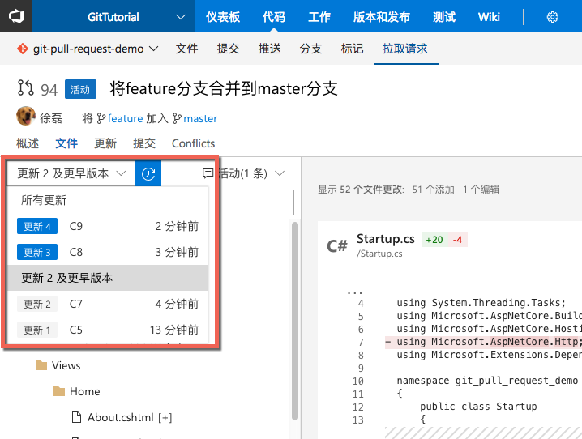

### 4. 完成拉取请求

当团队认为feature分支上的改动已经完成后，需要等待审阅者批准拉取请求，以便可以点击“完成”按钮。

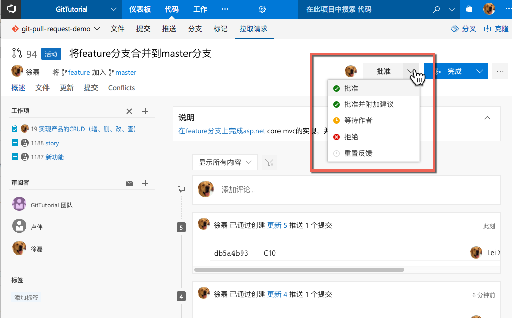

在审阅者列表中的所有用户都应该给出自己的评审意见，然后团队根据这些意见判断是否可以点击“完成”按钮。

> 注：这里需要注意的是，我们不会使用权限控制哪些人可以点击“完成”按钮，而是允许任何人在满足条件的情况下进行这个操作。这种设计鼓励团队采用协作的方式而不是流程的方式来管理代码质量；同时也推动团队真正将代码质量规范形成可执行可操作的规则。我见过非常多的团队有编码规范，但是无法执行的情况，其原因就是缺少一种简单易用的工具来支持这些规范的落地。

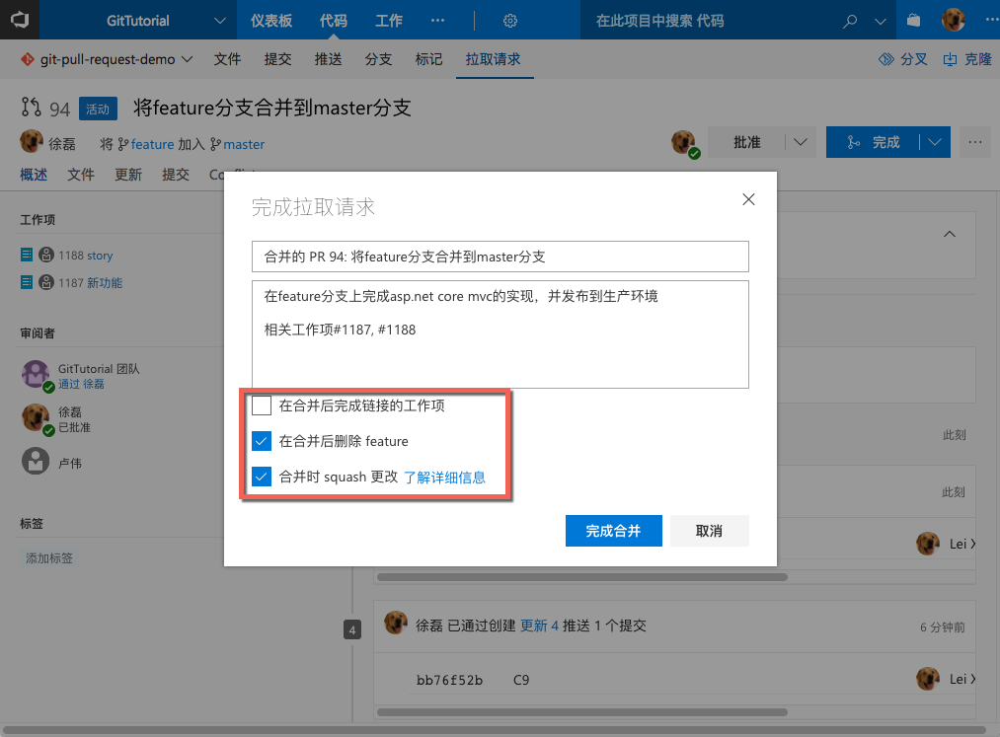

一旦团队点击完成合并按钮，TFS/VSTS会将分支的代码合并进入master，同时你可以选择是否删除feature分支，以及是否进行squash合并。

> 注：所谓的squash合并就是将在分支上所进行的所有提交压缩成一个提交放入master分支，这种做法可以有效的控制进入master分支的提交数量，帮助我们在master分支上建立干净和高可读性的历史记录。

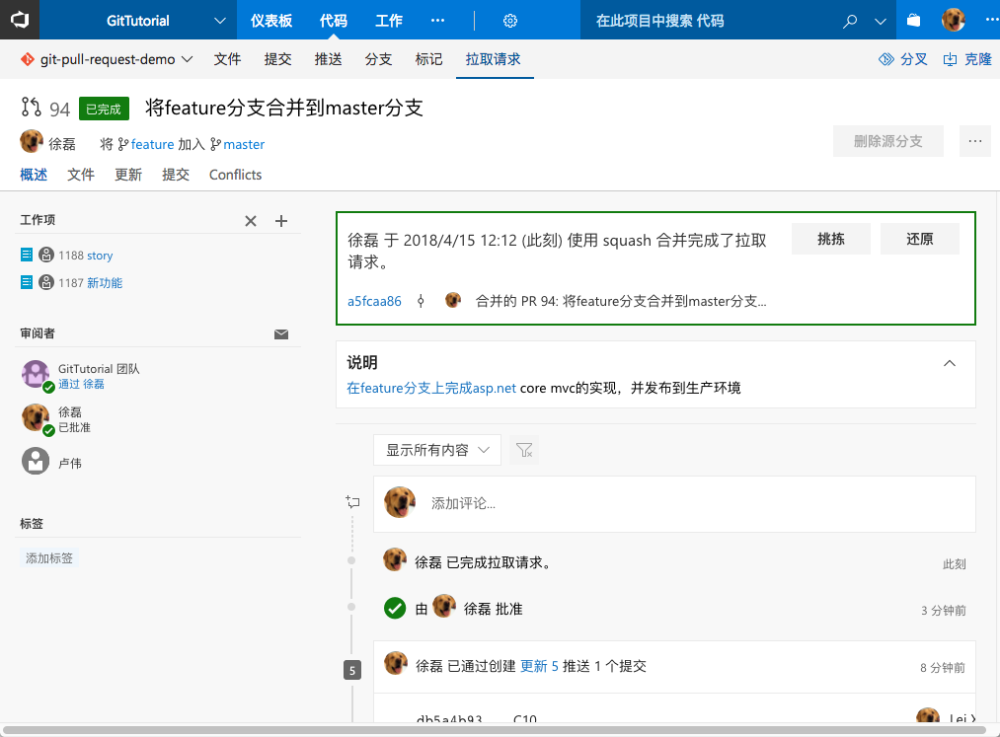

合并完成后，拉取请求的状态会变成上图的状态，提示你已经完成了代码合并。此时查看master的历史记录，可以看到有一条提交被创建。

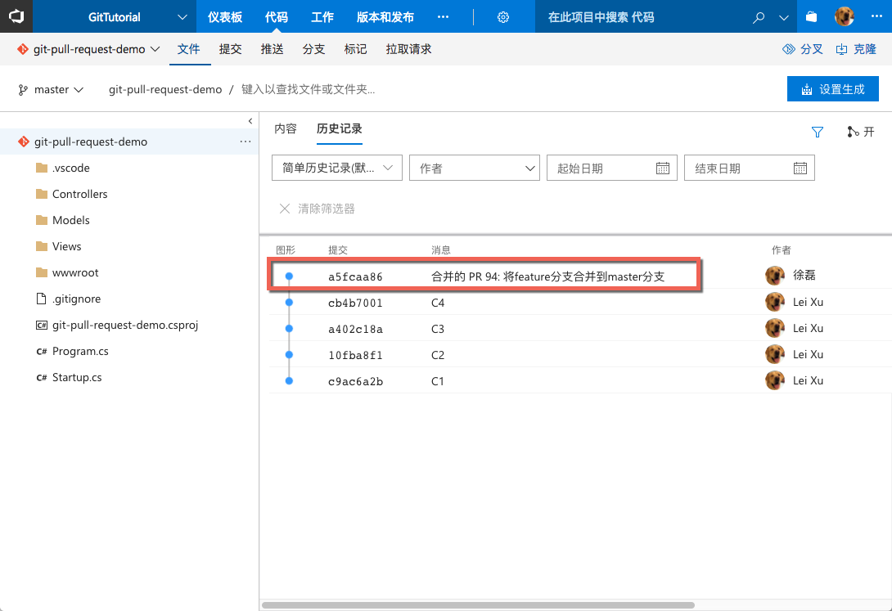

点击查看这条提交，可以跟踪到已经完成的拉取请求和关联的工作项，帮助团队在后续的开发中更好的了解所发生的改动。

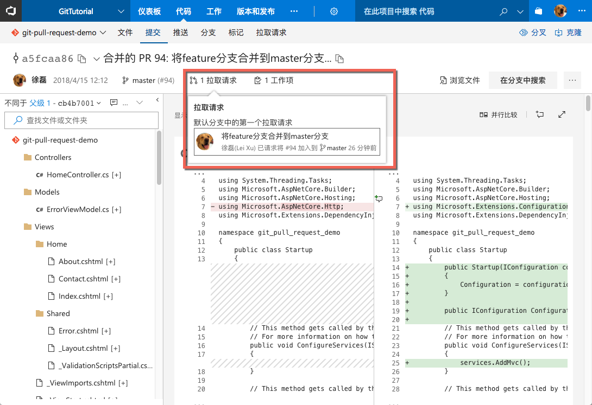

## 小结

拉取请求是Git中最有特色的功能，我一直认为如果使用Git而不使用拉取请求那么实际上根本没有发挥Git的最大优势。在这里一节中，我们对拉取请求的工作流程进行了介绍，相信大家已经对其中的代码评审环节印象深刻。实际使用中，这也是吸引很多团队开始使用拉取请求的原因，同时也是很多团队抛弃其他配置管理工具而切换到Git的重要原因。不仅如此，当你开始使用拉取请求之后，还有很多其他的可能性等待你的挖掘；比如：我们可以通过控制评审者和代码路径的映射做到针对不同代码模块自动指定评审者，我们还可以强制要求某些代码必须要由特定人员审核，如果结合持续集成工具，我们可以将持续集成结果作为完成拉取请求的先决条件，这样我们就可以将代码评审，代码合并与质量控制，测试结果等联系起来，真正做到一体化的质量控制。这些内容在后续的章节中会进行更为深入的介绍。

《Git企业开发者教程》的第一部分基础篇，到这里就告一段落了。在这一篇中我们对Git的很多基础知识进行了介绍，如果你认真阅读并且跟随其中的演示完成了实验，应该已经可以在项目中相对顺畅的使用Git了。在第二部分进阶篇中，我们将使用Visual Studio和命令行完成常见的Git操作，并对一些常见场景的处理方式进行更为深入详细的介绍。
