# 解决Git在Windows上使用http/https无法认证的问题

由于Git本身托身与Linux软件的开发过程，所以在Linux和类似的Mac环境中使用Git具备天然的优势，这也同时造成了在Windows
上使用Git的困难。这个问题在用户身份认证方面尤其明显，特别是对于企业开发者来说。你可能会在刚开始使用Git的时候遇到类似以下的错误信息，特别是针对
Team Foundation Server 所提供的Git服务器： 

 

Fatal: Authentication failed for …  

 

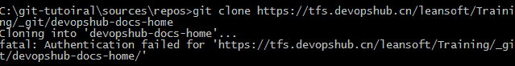

 

解决这个问题有2种方式 

 

##方式1 - 强制Git Crdential Manager for Windows使用Basic 认证方式 

 

我们需要针对 Git Credential Manager 进行一定的配置。Git Credential Manager
是一个插件系统，可以允许不同平台通过不同的工具将身份认证信息进行安全保存，避免在操作远程存储库的时候频繁输入用户名和密码。 

 

要解决以上问题，首先确保使用了最新版本的 Git for Windows
安装（至少2.15版本以上），并且在安装的时候配置了以下选项： 

 
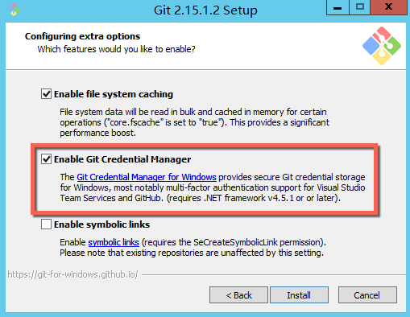
 

注：你还需要 .NET Framework 4.5.1或以上版本才能正常使用。 

 

安装完成后，请通过命令行输入以下命令 

 

运行以下命令 

 

\>\>\> git config --global credential.helper manager 

\>\>\> git config --global credential.modalprompt true 

\>\>\> git config --global credential.{你的TFS服务器地址}.authority Basic 

 

*注：以上{你的TFS服务器地址}需要替换成你自己的TFS服务器的地址，比如：我公司的TFS服务器是*
[https://tfs.companyXXX.com](https://tfs.companyxxx.com/)
*则需要执行的命令就是 *

 

*\>\>\>  git config --global credential.tfs.companyXXX.com.authority Basic  *

 

 

 

配置完成后就可以正常使用了，第一次从TFS远程存储库克隆代码时Windows会询问你的用户名和密码，输入成功克隆即可开始，后续的操作就不再会弹出了。 

 

 
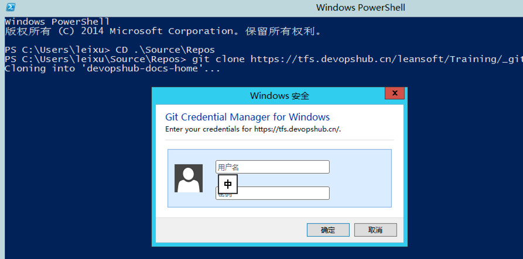
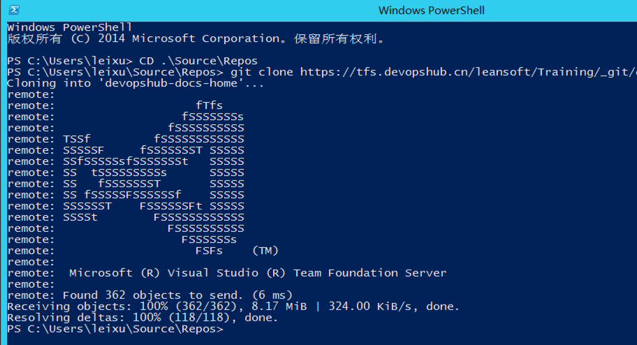
 

 

你刚才输入的认证信息被保存在 Windows 凭据管理器 里面了。 

 

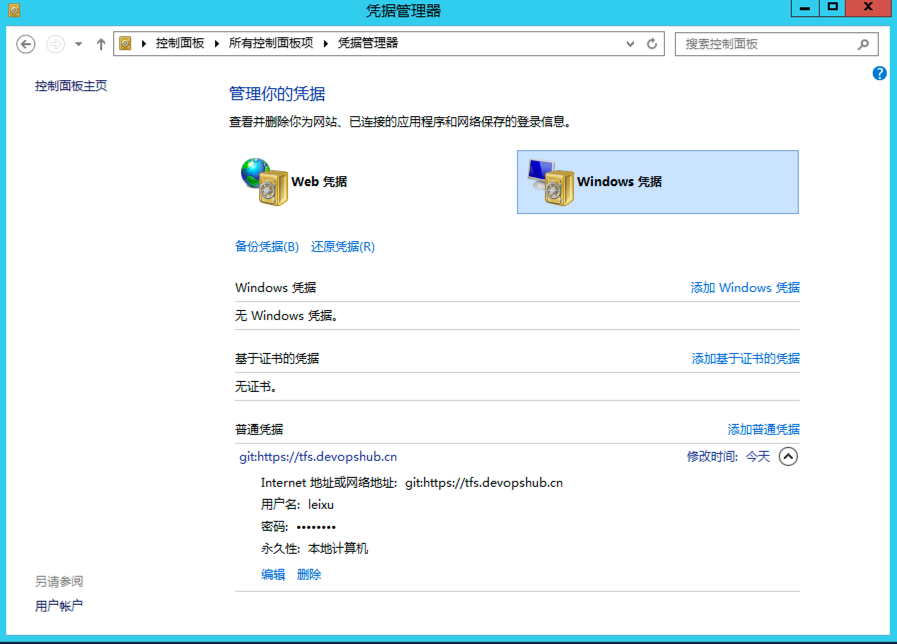

 

如果你连接的是VSTS，那么弹出的是类似以下的一个Azure Active Directory
(AAD)的登陆窗口，你需要输入你的Live
ID。完成之后，你的身份信息会被存放在Windows凭据管理器，不过存放的是一个叫做PAT
(Person Access Token)的令牌。 

 
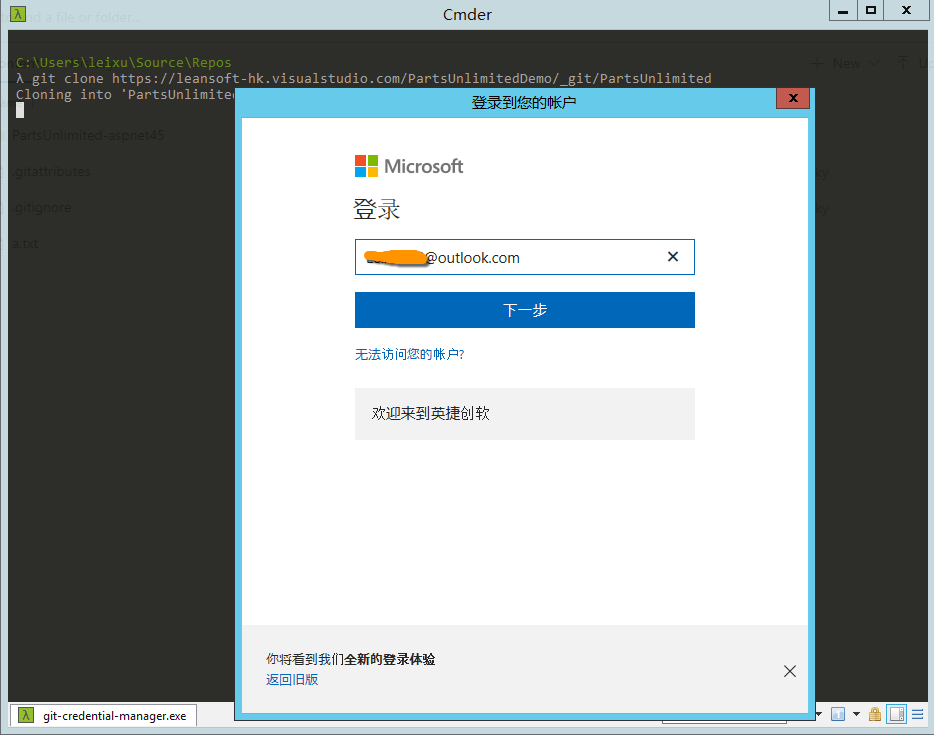
 

如果要查看这个令牌，可以通过当前用户的菜单中选择 Security进入 Personal Access
Token的配置页面进行查看 

 
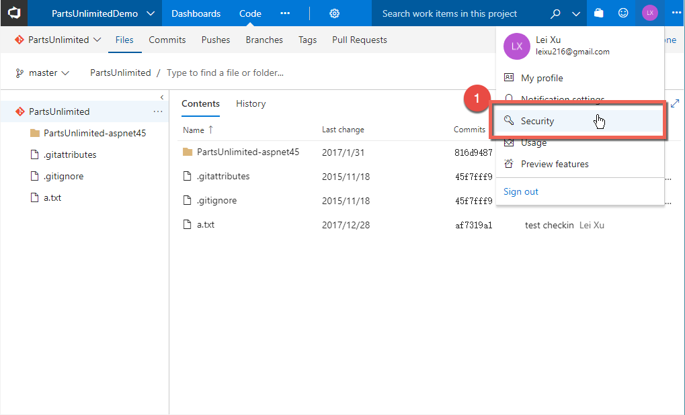
 

你会主要到这个PAT只对 Code (read and write) 和 Packing
(read)两项内容进行了授权，这是为了确保最小安全性配置。 

 
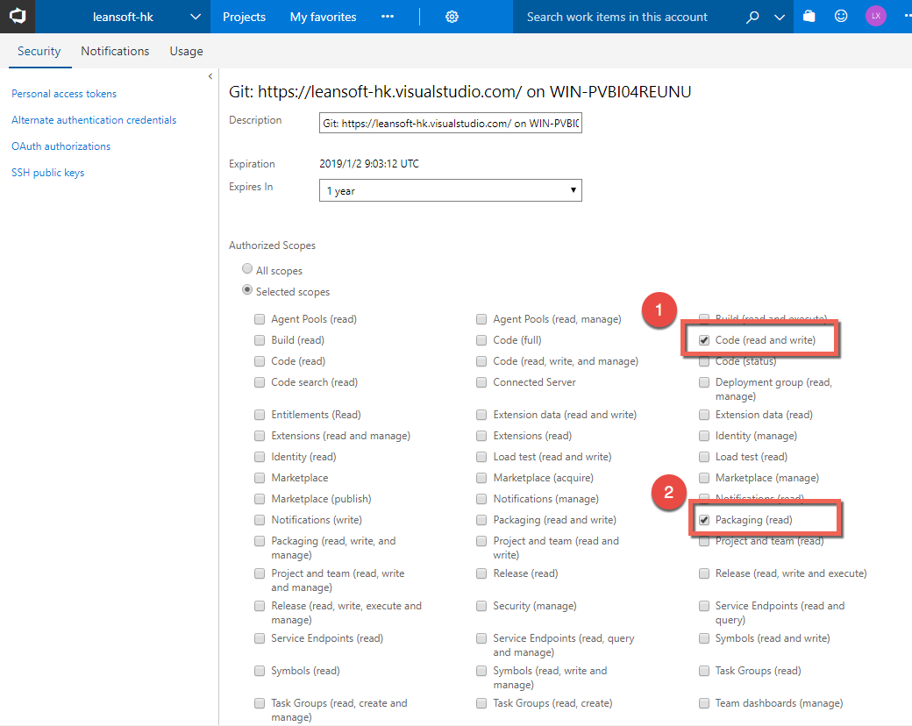
 

进入Windows凭据管理器管理器，你就可以看到这个凭据已经被保存。 

 

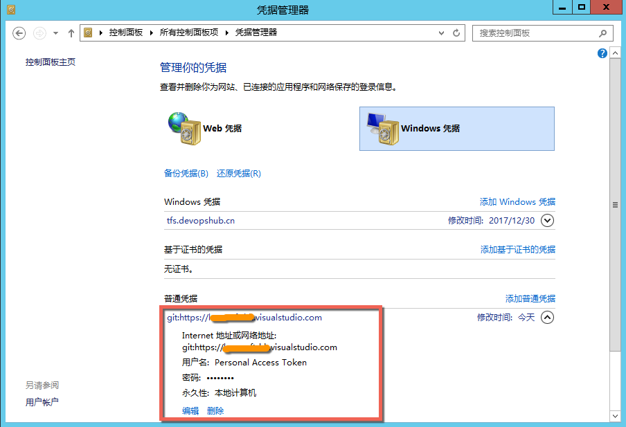

 

###Git Credential Manager for Windows 的工作机制 

 

这个 Credential
Manager会首先尝试使用当前登陆计算机的用户账号连接远程的TFS服务器，如果本地计算机和远程TFS同在一个AD域并且登陆账号已经具备了访问Git仓库的权限，则会直接成功；如果不成功则会弹出登陆对话框要求用户登录。 

 

但是如果当前计算机没有在TFS所属的AD域中，则会直接给出Authentication
Failed的错误并退出，这是因为在这个场景下无法直接使用NTLM进行身份认证（因为不在同一个域），但是因为TFS返回的信息要求使用NTLM，就会出现以上问题。 

 

我们的解决办法是强制本地的 Credential Manager
使用Basic方式发送用户名和密码，虽然在这种情况下会有一定的安全性问题，但是如果服务器启用了https加密就没有关系了。 

 

##方法 2 - 使用SSH Key的方式进行认证 

 

SSH Key
认证方式是在Linux/MacOS上非常常见的一种认证方式，在Git中也被很好的支持，如果要在Windows上使用，首先我们需要使用cmder命令行工具生成自己的ssh
key pair。 

 

在cmder工具中输入以下命令 

 

ssh-keygen -C "密钥注释" 

 
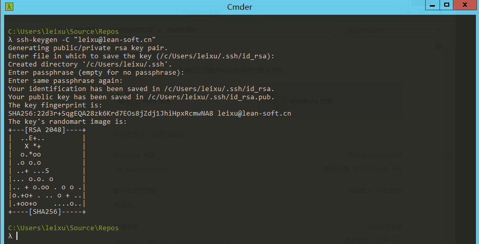
 

注意：以上我使用了所有参数的默认值，特别是passphrase中也使用了空密码，这主要是为了方便在操作存储库的时候不用一直输入密码。 

 

生成的 ssh key pair （包括公钥和私钥文件）会被保存到
c:\\users\\{当前用户}\\.ssh目录中，如下图： 

 
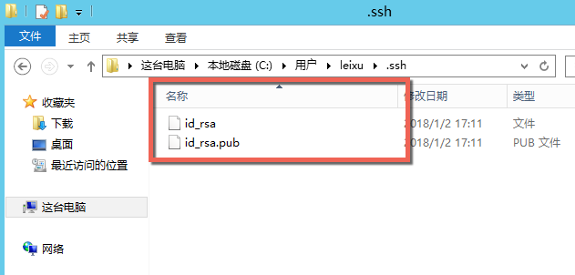
 

ssh key pair
生成好以后还需要把公钥文件的内容（以上.pub文件）复制到VSTS/TFS服务器的SSH
KEY列表中，确保VSTS/TFS服务器可以识别 

 

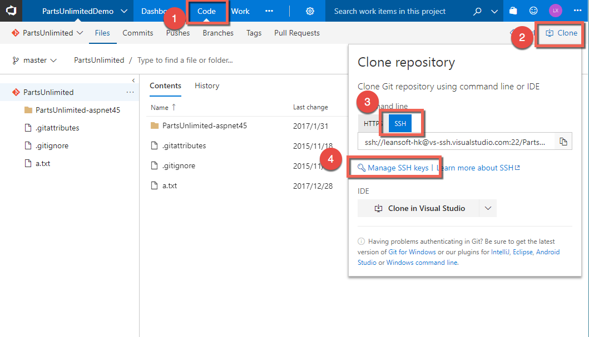
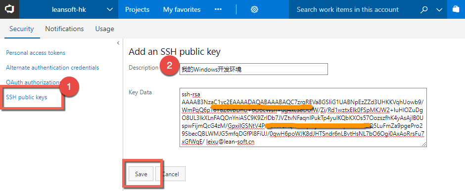
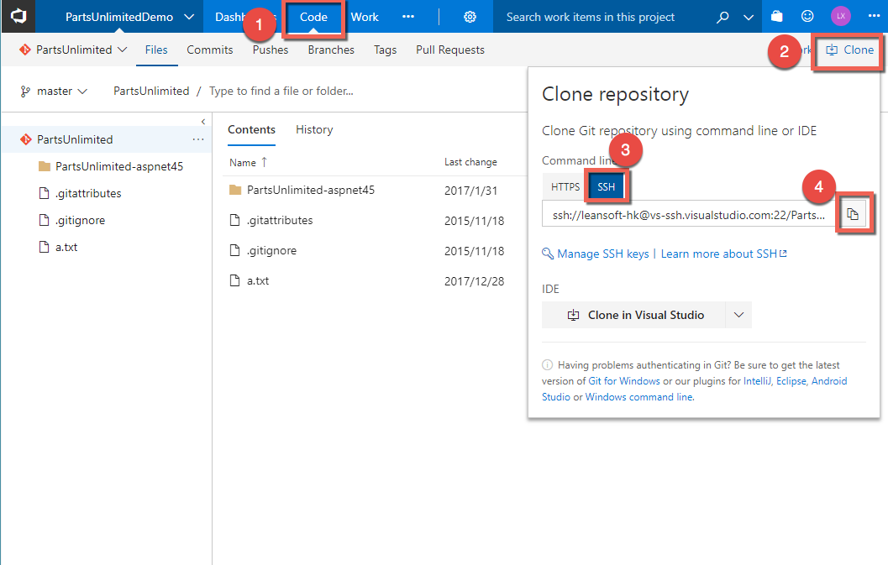

 

然后就可以通过ssh url来操作git存储库了，首先获取ssh url如下图 

 

 

然后使用 git clone命令克隆代码 

 

\>\>\> git clone {ssh url} 

 

 

*注：如果使用的是自己搭建的TFS服务器，还需要确保服务器的22端口已经正确打开 *

 

##小结 

 

以上2种版本都可以确保你在Windows上顺利的连接到远程Git存储库。 
