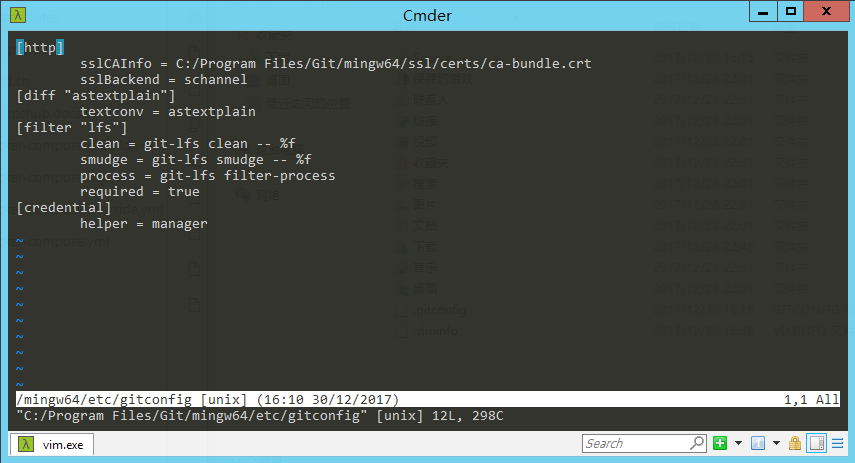
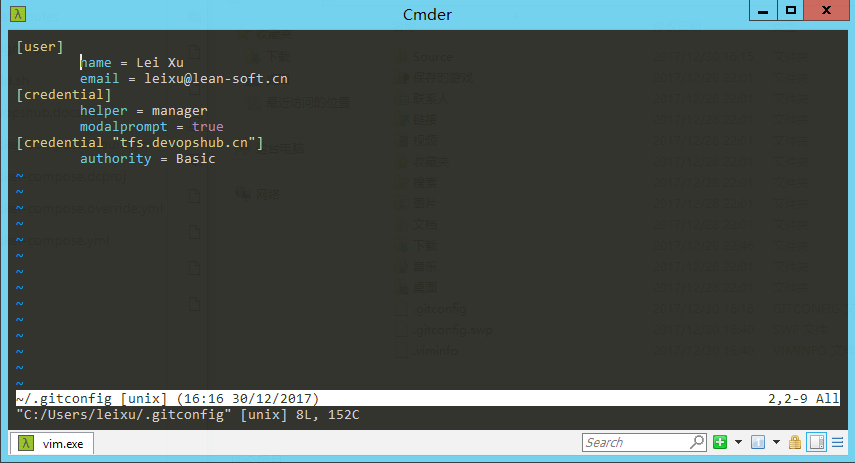
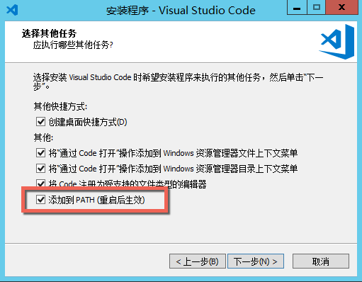
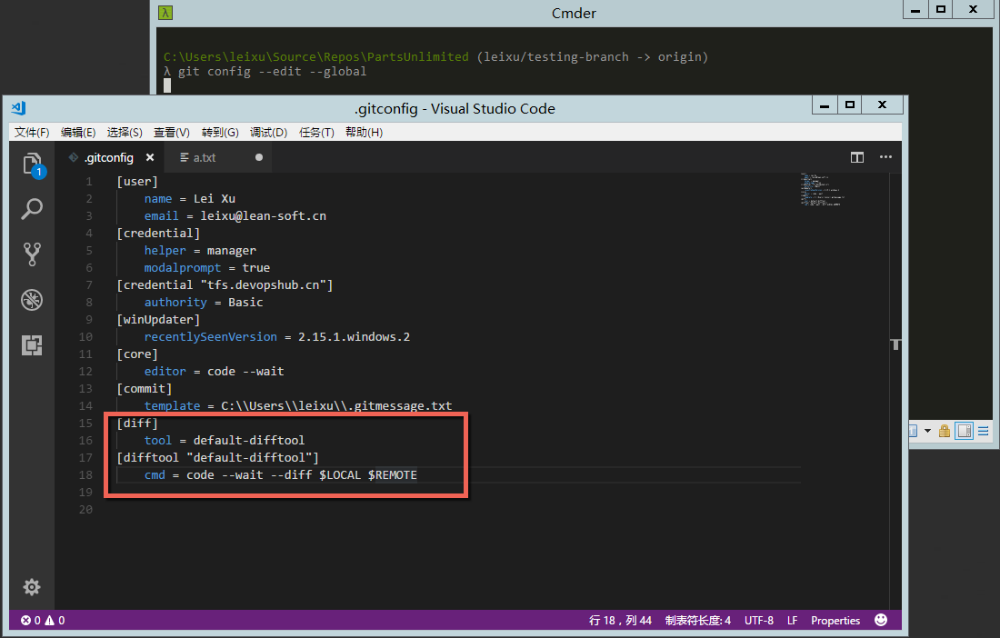
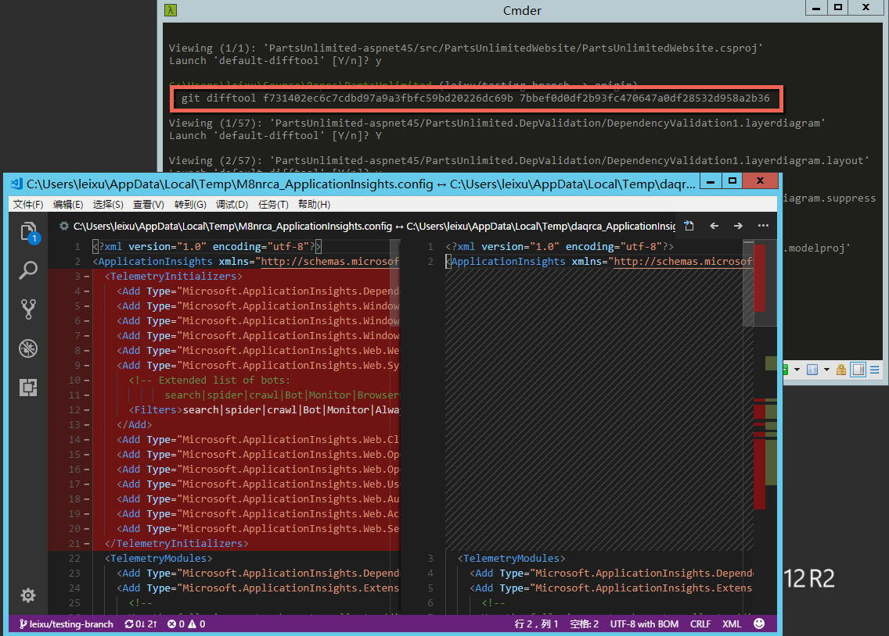
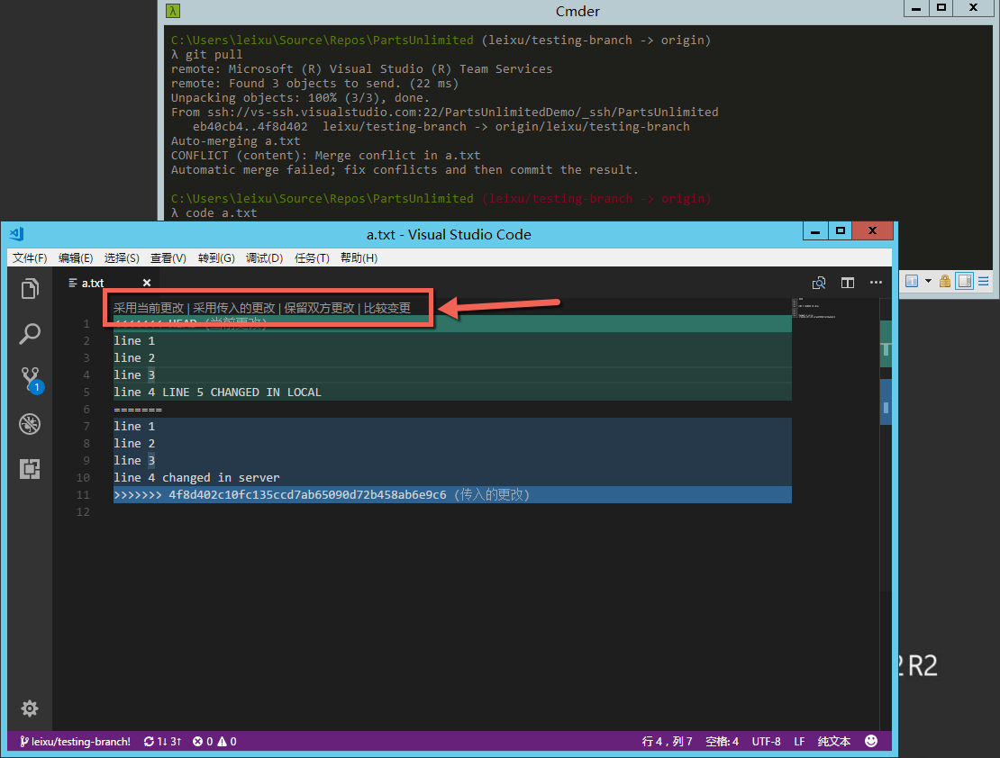

# 如何修改 gitconfig 和常用配置

Gitconfig
文件可以帮助我们对很多常用的git行为进行配置，让你自己的git环境更加适合你自己的偏好。 

 

##gitconfig的三级配置系统 

 

我们在某个git仓库中看到的.gitignore和.gitattributes都属于Git的三级配置系统的第三级，用于对当前仓库进行配置，另外两个级别分别是
global 和 system。 他们的结构如下 

 

-   system  

    -   global 

        -   repo 1 

        -   repo 2 

        -   … 

 

system 为系统级配置文件，在Windows上存放于Git的安装目录下（默认位置为C:\\Program
Files\\Git\\mingw64\\etc\\gitconfig）。如果要直接对这个配置进行编辑可以使用以下命令 

 

git config --edit --system  

 

 

*注：编辑系统级配置的命令行窗口需要提升权限运行，否则无法保存。 *

 

global 为当前用户的全局配置文件，在Windows上存放于当前用户的根目录（默认为
C:\\Users\\{你的用户名\\.gitconfig）。如果要直接对这个配置进行编辑可以使用以下命令 

 

git config --edit --global 

*注：你会注意到我们在Git安装配置那一章中所做的配置实际上就是在修改这个文件。 *

 

Repo
级别就是当前存储库的配置文件，存放在当前存储库的根目录，编辑时需要先进入当前存储库的目录，再执行以下命令 

 

git config --edit  

 

 

以上我们提到的.gitattribute .gitconfig
.gitignore都可以通过这三个级别分别配置，越接近git repo的配置生效级别越高。 

 

 

##用户名和邮件地址 

 

用户名和邮件地址是必须的配置，如果不完成以下配置你是不能提交代码的。具体命令如下： 

 

git config --global user.name "{你的名字}"   
git config --global user.email {你的邮件地址} 

 

*注：git不会验证你的用户名和邮件地址和Git服务器统一，因为git是分布式的，你用来连接中心Git服务器的用户名并不是通过这个方式来保存的。这里所配置的仅仅是个标识而已，这种设计可以允许git灵活的在不同的存储库之间交换代码。但是对于企业开发者来说，如果你需要提交代码到企业的中心Git仓库，建议你使用企业分配给你的邮件地址，这样便于其他人识别你的改动。 *

 

##默认编辑器 

 

Git默认会使用vim作为文本编辑器，这对很多Windows用户来说非常不友好，你可以使用以下命令可以配置git默认使用的文本编辑器工具： 

 

git config --global core.editor "code --wait" 

 

*注：这个命令将git当前用户的编辑器工具配置成 Visual Studio
Code，要确保以上配置工作，你要保证vscode安装过程中选择以下选项，允许使用code命令在任何位置启动。 *

 

 

提交说明模版 

 

提交代码时所提供的说明对于团队协作非常重要，你应该在提交代码的说明中尽量明确的描述所进行的修改，保证团队成员可以看懂你所做的改动。Git允许你使用一个模版来提示开发人员应该编写的内容。比如： 

 

Subject line (try to keep under 50 characters)   
 

Multi-line description of commit,   
feel free to be detailed.   
 

[Ticket: X] 

 

你可以把这个文件保存起来（比如：.gitmessage.txt），并通过以下命令配置git在进行commit的时候使用这个文件作为提交注释的模版 

 

git config --global commit.template c:\\users\\用户名\\.gitmessage.txt 

 

具体使用的效果如下（结合前面的配置使用vscode作为编辑器的效果） 

 

 

排除文件 

 

我们可以使用.gitignore文件来针对某个特定的git存储库配置排除文件，但有些时候我们希望在所有存储库中都派出某些特定文件，比如：如果你使用macOS，那么你就知道每个文件夹下面都有有一个.DS_Store的文件，不小心就会被提交上去，非常讨厌。这种情况下你可以创建一个全局的.gitignore_global文件，包含类似以下内容 

 

\*\~   
.\*.swp   
.DS_Store 

 

然后通过以下命令将这些文件进行全局排除 

 

git config --global core.excludesfile c:\\users\\用户名\\.gitignore_global 

 

##外部冲突合并和比较工具 

 

Git默认的比较工具比较难用，通过以下配置我们可以将Visual Studio
Code设置成比较工具。使用以下命令直接编辑当前用户的全局配置 

 

git config --edit --global 

 

在其中添加以下内容 

 

[diff]   
    tool = default-difftool   
[difftool "default-difftool"]   
    cmd = code --wait --diff \$LOCAL \$REMOTE 

 

如下图 

 

 

配置完成后我们就可以通过git difftool命令启动比较，具体格式 

 

git difftool \<commit\> \<commit\> 

 

 

另外，当文件出现冲突时，我们也可以通过 Visual Studio Code
进行可视化的合并操作，注意以下vscode编辑器中的选项：**采用当前更改 \|
采用传入的更改 \| 保留双方更改 \| 比较变更** 

 

 

我相信很多刚刚接触git的同学非常害怕碰到这个带有一堆\<\<\<\<\<的冲突信息，会不知所措，有个这个可视化的合并工具以后一切就变得非常简单而自然了。 

 

*注：以上并没有覆盖所有gitconfig的内容，我只是把大家常用的一些配置放在这里供大家参考，如果需要了解所有gitconfig能够进行的配置请访问git官方文档。 *

 

参考： 

<https://www.git-scm.com/book/en/v2/Customizing-Git-Git-Configuration> 

<https://stackoverflow.com/questions/30024353/how-to-use-visual-studio-code-as-default-editor-for-git> 
